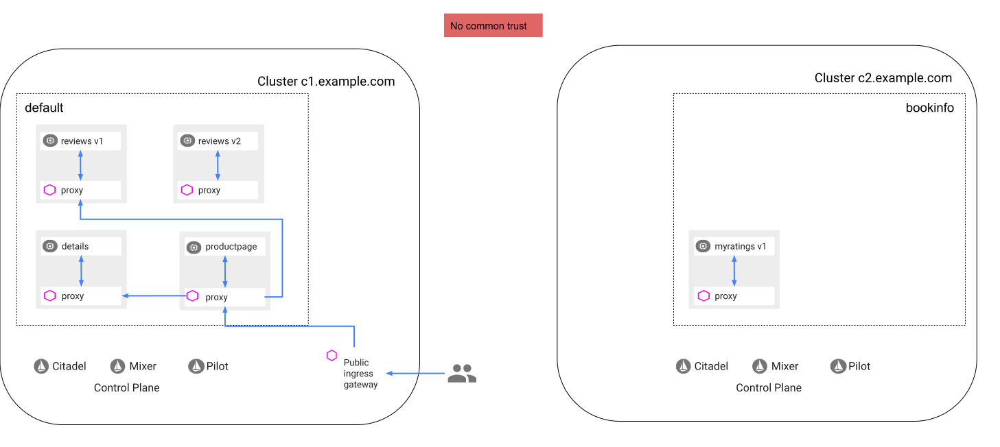
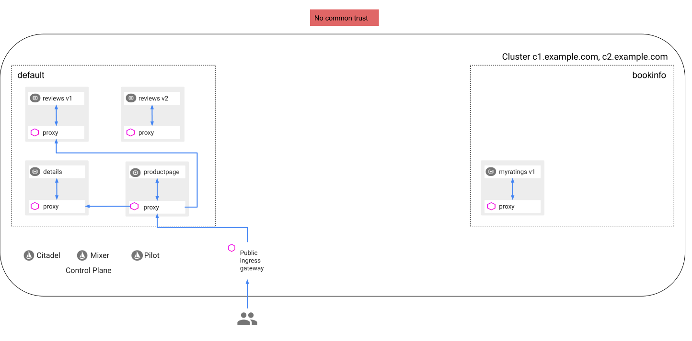
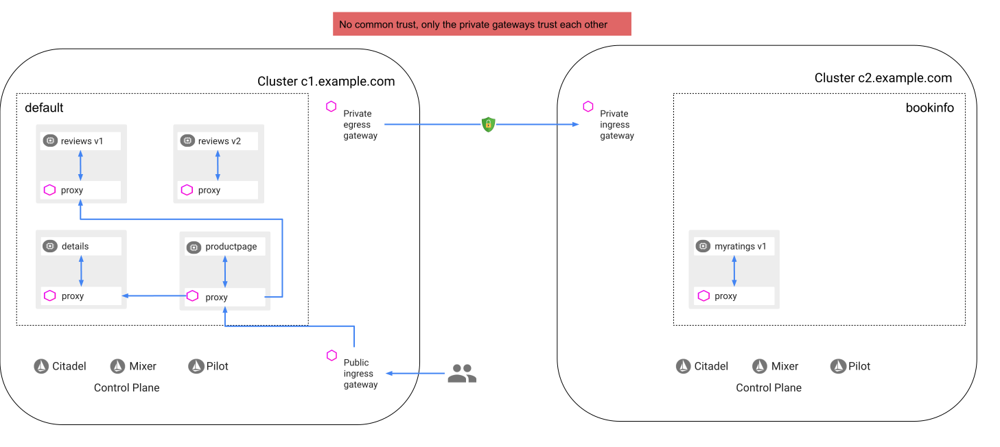
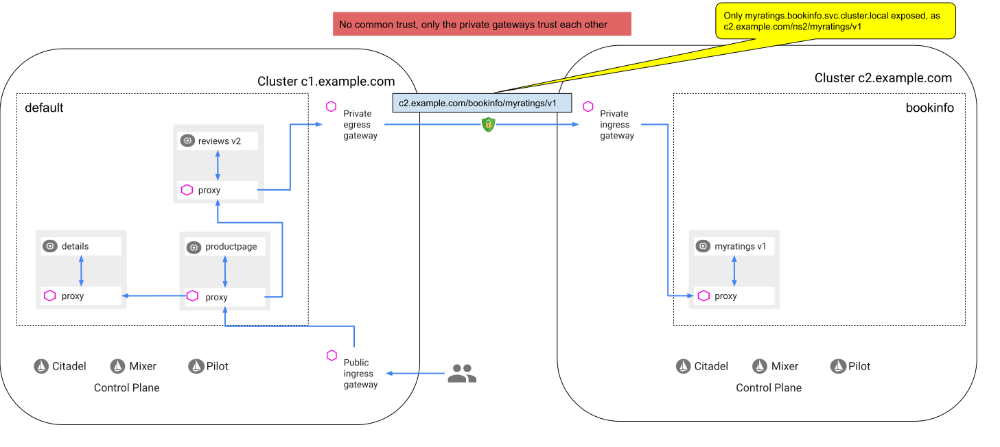
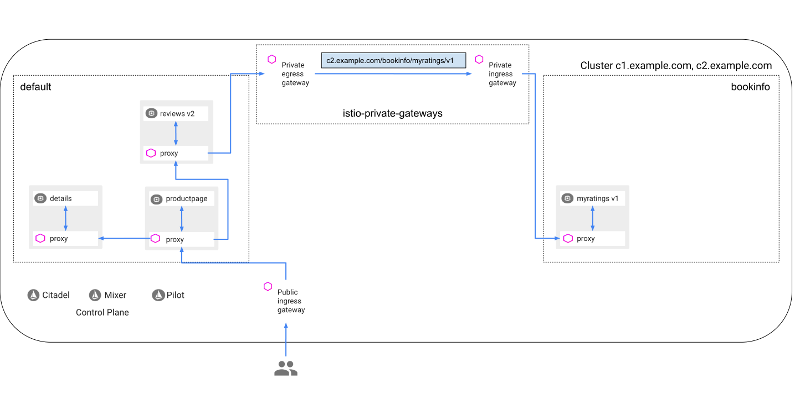

# Ad-hoc limited-trust mesh federation

This example uses the Istio
[Bookinfo](https://istio.io/docs/examples/bookinfo/) application as an example for a mesh-federation approach. It lists the principles of the approach first, then the prerequisites for running the example,  instructions to _federate_ two meshes, and finally troubleshooting and cleanup instructions.

## Principles

- use **standard Istio mechanisms** such as gateways, virtual services, destination rules, RBAC.
- use **standard Istio installations**.
- **ad hoc mesh federration** at any time. The owners of the meshes can install Istio and operate it independently,
  and decide to _federate_ the meshes at some later point in time.
- **private gateways for cross-cluster communication**, with dedicated certificates and private keys.
- **limited trust**: Only the gateways trust each other, there is no trust between sidecars from different meshes.

## Prerequisites

You can perform the instructions in this blog post on two Kubernetes clusters or on a single cluster.

The case of a single cluster demonstrates isolation between namespaces within the same cluster. To implement isolation
between namespaces you must use
[Kubernetes network policies](https://kubernetes.io/docs/concepts/services-networking/network-policies/)
that forbid direct communication between namespaces. You use Istio to connect two namespaces with boundary protection,
in the same way you use Istio to connect two clusters, as I show in this blog post.
You may want to use a single cluster for easy testing of the instructions of this blog post, even if your goal is to
connect multiple clusters. To better understand isolation between namespaces in a single cluster, take a look at an
[initial state](#a-single-cluster-with-isolation-between-namespaces-after-initial-setup) of a single cluster
and the
[state of the cluster with two namespaces connected](#a-single-cluster-with-isolation-between-namespaces-after-configuring-exposing-and-consuming-the-ratings-service)
by Istio, with boundary protection.

### Prerequisites for two clusters

Two Kubernetes clusters (referred to as `cluster1` and `cluster2`) with default Istio installations.

*   You can use the `kubectl` command to access both the `cluster1` and `cluster2` clusters with the `--context` flag,
    for example `kubectl get pods --context cluster1`.
    Use the following command to list your contexts:

    ```bash
    kubectl config get-contexts
    ```
    ```
    CURRENT   NAME       CLUSTER    AUTHINFO       NAMESPACE
    *         cluster1   cluster1   user@foo.com   default
              cluster2   cluster2   user@foo.com   default
    ```

*   Store the context names of your clusters in environment variables:

    ```bash
    export CTX_CLUSTER1=$(kubectl config view -o jsonpath='{.contexts[0].name}')
    export CTX_CLUSTER2=$(kubectl config view -o jsonpath='{.contexts[1].name}')
    echo CTX_CLUSTER1 = ${CTX_CLUSTER1}, CTX_CLUSTER2 = ${CTX_CLUSTER2}
    ```
    ```
    CTX_CLUSTER1 = cluster1, CTX_CLUSTER2 = cluster2
    ```

    _If you have more than two clusters in the context list and you want to configure your mesh using clusters other than
    the first two, you will need to manually set the environment variables to the appropriate context names._

### Prerequisites for a single cluster

A single Kubernetes cluster with a default Istio installation. I wrote the instructions in this blog post to handle
both the case of two clusters and the case of a single cluster. In the case of a single cluster, the instructions refer
to the same cluster as "the first cluster" and "the second cluster", and use `CTX_CLUSTER1` and `CTX_CLUSTER2`
environment variables to refer to the same cluster.

Store the context name of your cluster in environment variables:

```bash
export CTX_CLUSTER1=$(kubectl config current-context)
export CTX_CLUSTER2=${CTX_CLUSTER1}
echo CTX_CLUSTER1 = ${CTX_CLUSTER1}, CTX_CLUSTER2 = ${CTX_CLUSTER2}
```
```
CTX_CLUSTER1 = cluster1, CTX_CLUSTER2 = cluster1
```

## Initial setup

In each of the clusters, deploy the [sleep](https://github.com/istio/istio/tree/master/samples/sleep) sample app to use as a test source for
sending requests.

```bash
kubectl apply -f samples/sleep/sleep.yaml
```

### Setup the first cluster

1. Install the [Bookinfo](https://istio.io/docs/examples/bookinfo/) sample application,
[confirm the app is accessible outside the cluster](https://istio.io/docs/examples/bookinfo/#confirm-the-app-is-accessible-from-outside-the-cluster),
and [apply default destination rules](https://istio.io/docs/examples/bookinfo/#apply-default-destination-rules).

1.  Direct the traffic to the `v1` version of all the microservices:

    ```bash
    kubectl apply --context=$CTX_CLUSTER1 -f samples/bookinfo/networking/virtual-service-all-v1.yaml
    ```
    ```
    virtualservice.networking.istio.io/productpage created
    virtualservice.networking.istio.io/reviews created
    virtualservice.networking.istio.io/ratings created
    virtualservice.networking.istio.io/details created
    ```

    Access the web page of the Bookinfo application and verify that the reviews appear without stars, which means that
    the `v1` version of _reviews_ is used.

1.  Delete the deployments of `reviews v3` and `ratings v1`:

    ```bash
    kubectl delete deployment reviews-v3 ratings-v1 --context=$CTX_CLUSTER1
    kubectl delete service ratings --context=$CTX_CLUSTER1
    ```
    ```
    deployment.extensions "reviews-v3" deleted
    deployment.extensions "ratings-v1" deleted
    service "ratings" deleted
    ```

    Access the webpage of the Bookinfo application and verify that it continues to work as before.

1.  Check the pods:

    ```bash
    kubectl get pods --context=$CTX_CLUSTER1
    ```
    ```
    details-v1-59489d6fb6-m5s5j       2/2     Running   0          4h31m
    productpage-v1-689ff955c6-7qsk6   2/2     Running   0          4h31m
    reviews-v1-657b76fc99-lx46g       2/2     Running   0          4h31m
    reviews-v2-5d5d57db85-5zdnc       2/2     Running   0          4h31m
    sleep-57f9d6fd6b-px97z            2/2     Running   0          4h31m
    ```

    You should have four pods of the Bookinfo application and a pod for the sleep testing app.

### Setup the second cluster

1.  Create the `bookinfo` namespace and label it for sidecar injection. Note that while you deployed the Bookinfo
    application in the first cluster in the `default` namespace, you use the `bookinfo`
    namespace in the second cluster. This is to demonstrate that you can use different namespaces in the clusters you
    federate, there is no requirement for uniform naming.

    ```bash
    kubectl create --context=$CTX_CLUSTER2 namespace bookinfo
    kubectl label --context=$CTX_CLUSTER2 namespace bookinfo istio-injection=enabled
    ```
    ```
    namespace/bookinfo created
    namespace/bookinfo labeled
    ```

1.  Deploy `ratings v1`:

    ```bash
    kubectl apply --context=$CTX_CLUSTER2 -l app!=ratings,app!=reviews,app!=details,app!=productpage -n bookinfo -f samples/bookinfo/platform/kube/bookinfo.yaml
    kubectl apply --context=$CTX_CLUSTER2 -l app=ratings -n bookinfo -f samples/bookinfo/platform/kube/bookinfo.yaml
    ```
    ```
    serviceaccount/bookinfo-details created
    serviceaccount/bookinfo-ratings created
    serviceaccount/bookinfo-reviews created
    serviceaccount/bookinfo-productpage created
    service/ratings created
    deployment.apps/ratings-v1 created
    ```

1.  Check the pods in the `bookinfo` namespace:

    ```bash
    kubectl get pods -n bookinfo --context=$CTX_CLUSTER2
    ```
    ```
    ratings-v1-85f65447f4-vk88z   2/2     Running   0          43s
    ```

    You should have a single pod of the `ratings` service.

1.  Create a service for ratings. Call it `myratings`, to demonstrate that you can use different names for services in
    the clusters, there is no requirement for uniform naming.

    ```bash
    kubectl apply -n bookinfo --context=$CTX_CLUSTER2 -f - <<EOF
    apiVersion: v1
    kind: Service
    metadata:
      name: myratings
      labels:
        app: ratings
    spec:
      ports:
      - port: 9080
        name: http
      selector:
        app: ratings
    EOF
    ```

1.  Delete the `ratings` service (`myratings` will be used instead):

    ```bash
    kubectl delete --context=$CTX_CLUSTER2 -l service=ratings -n bookinfo -f samples/bookinfo/platform/kube/bookinfo.yaml
    ```
    ```
    service "ratings" deleted
    ```

1.  Create a destination rule for `myratings`:

    ```bash
    kubectl apply -n bookinfo --context=$CTX_CLUSTER2 -f - <<EOF
    apiVersion: networking.istio.io/v1alpha3
    kind: DestinationRule
    metadata:
      name: ratings
    spec:
      host: myratings
      trafficPolicy:
        tls:
          mode: ISTIO_MUTUAL
      subsets:
      - name: v1
        labels:
          version: v1
    EOF
    ```

1.  Verify that `myratings.bookinfo` works as expected:

    ```bash
    kubectl exec -it $(kubectl get pod -l app=sleep -o jsonpath='{.items..metadata.name}' --context=$CTX_CLUSTER2) -c sleep --context=$CTX_CLUSTER2 -- curl myratings.bookinfo:9080/ratings/0 -w "\nResponse code: %{http_code}\n"
    ```
    ```
    {"id":0,"ratings":{"Reviewer1":5,"Reviewer2":4}}
    Response code: 200
    ```

The following diagram shows the state of the clusters after deploying the Bookinfo services:



### A single cluster with isolation between namespaces after initial setup

In case you perform the instructions in this blog post on a single cluster, your cluster has the following state now:



## Deploy private gateways for cross-cluster communication (one-time setup)

In this section you create certificates and keys for `cluster1` and `cluster2` and deploy an egress gateway in `cluster1`
and an ingress gateway in `cluster2`. You mount the certificates and the keys to the gateways to establish trust between
the gateways. Note that only the gateways trust each other, there is no trust between workloads in the different
clusters.
These gateways could be different from the public gateways you use to control
[ingress](https://istio.io/docs/tasks/traffic-management/ingress/secure-ingress-mount/)
and
[egress](https://istio.io/docs/tasks/traffic-management/egress/egress-gateway/)
traffic
from and to the public Internet. You may want to deploy them on a private network of your
organization (or of your cloud provider) to reduce the possibilities for attacks from the public Internet. You may want
to use these gateways for cross-cluster communication only.

In this blog post you use non-existent hostnames, `c1.example.com`, `c2.example.com` and `c3.example.com`, as the
hostnames of three clusters. You do not deploy a third cluster in this blog post, only use its identity for testing RBAC
policies.

### Generate certificates and keys for both clusters

You can use the command of your choice to generate certificates and keys, the command below use
[openssl](https://man.openbsd.org/openssl.1).

1.  Create an `openssl` configuration file for `cluster1`:

    ```bash
    cat > ./certificate1.conf <<EOF
    [ req ]
    encrypt_key = no
    prompt = no
    utf8 = yes
    default_md = sha256
    req_extensions = req_ext
    x509_extensions = req_ext
    distinguished_name = req_dn
    [ req_ext ]
    subjectKeyIdentifier = hash
    basicConstraints = critical, CA:false
    keyUsage = critical, digitalSignature, nonRepudiation
    extendedKeyUsage = clientAuth
    subjectAltName = critical, @san
    [req_dn]
    O=example Inc., department 1
    CN=c1.example.com
    [ san ]
    URI.1 = spiffe://c1.example.com/istio-private-egressgateway
    EOF
    ```

1.  Create a configuration file for `cluster2`:

    ```bash
    cat > ./certificate2.conf <<EOF
    [ req ]
    encrypt_key = no
    prompt = no
    utf8 = yes
    default_md = sha256
    req_extensions = req_ext
    x509_extensions = req_ext
    distinguished_name = req_dn
    [ req_ext ]
    subjectKeyIdentifier = hash
    basicConstraints = critical, CA:false
    keyUsage = critical, digitalSignature, nonRepudiation
    extendedKeyUsage = serverAuth
    subjectAltName = critical, @san
    [req_dn]
    O=example Inc., department 2
    CN=c2.example.com
    [ san ]
    URI.1 = spiffe://c2.example.com/istio-private-ingressgateway
    EOF
    ```

1.  Create a configuration file for `cluster3`. You do not deploy a third cluster in this blog post, only use the
    certificate and key of `cluster3` for testing RBAC policies.

    ```bash
    cat > ./certificate3.conf <<EOF
    [ req ]
    encrypt_key = no
    prompt = no
    utf8 = yes
    default_md = sha256
    req_extensions = req_ext
    x509_extensions = req_ext
    distinguished_name = req_dn
    [ req_ext ]
    subjectKeyIdentifier = hash
    basicConstraints = critical, CA:false
    keyUsage = critical, digitalSignature, nonRepudiation
    extendedKeyUsage = clientAuth
    subjectAltName = critical, @san
    [req_dn]
    O=example Inc., department 3
    CN=c3.example.com
    [ san ]
    URI.1 = spiffe://c3.example.com/istio-private-egressgateway
    EOF
    ```

1.  Create the certificates and the keys:

    ```bash
    openssl req -x509 -sha256 -nodes -days 365 -newkey rsa:2048 -subj '/O=example Inc./CN=example.com' -keyout example.com.key -out example.com.crt
    openssl req -reqexts req_ext -out c1.example.com.csr -newkey rsa:2048 -nodes -keyout c1.example.com.key -config ./certificate1.conf
    openssl x509 -req -days 365 -CA example.com.crt -CAkey example.com.key -set_serial 0 -in c1.example.com.csr -out c1.example.com.crt -extensions req_ext -extfile ./certificate1.conf
    openssl req -reqexts req_ext -out c2.example.com.csr -newkey rsa:2048 -nodes -keyout c2.example.com.key -config ./certificate2.conf
    openssl x509 -req -days 365 -CA example.com.crt -CAkey example.com.key -set_serial 1 -in c2.example.com.csr -out c2.example.com.crt -extensions req_ext -extfile ./certificate2.conf
    openssl req -reqexts req_ext -out c3.example.com.csr -newkey rsa:2048 -nodes -keyout c3.example.com.key -config ./certificate3.conf
    openssl x509 -req -days 365 -CA example.com.crt -CAkey example.com.key -set_serial 2 -in c3.example.com.csr -out c3.example.com.crt -extensions req_ext -extfile ./certificate3.conf
    ```

### Deploy a private egress gateway in the first cluster

1.  Create the `istio-private-gateways` namespace:

    ```bash
    kubectl apply --context=$CTX_CLUSTER1 -f - <<EOF
    apiVersion: v1
    kind: Namespace
    metadata:
      name: istio-private-gateways
    EOF
    ```

1. Create Kubernetes [Secrets](https://kubernetes.io/docs/concepts/configuration/secret/) to hold the gateways's
   certificates and keys.

    ```bash
    kubectl create --context=$CTX_CLUSTER1 -n istio-private-gateways secret tls c1-example-com-certs --key c1.example.com.key --cert c1.example.com.crt
    kubectl create --context=$CTX_CLUSTER1 -n istio-private-gateways secret generic c1-trusted-certs --from-file=example.com.crt
    ```

1.  Deploy a private egress gateway and mount the new secrets as data volumes by the following command:

    ```bash
    cat <<EOF | helm template install/kubernetes/helm/istio/ --name istio --namespace istio-private-gateways -x charts/gateways/templates/deployment.yaml -x charts/gateways/templates/service.yaml -x charts/gateways/templates/serviceaccount.yaml -x charts/gateways/templates/autoscale.yaml -x charts/gateways/templates/role.yaml -x charts/gateways/templates/rolebindings.yaml --set global.istioNamespace=istio-system -f - | kubectl apply --context=$CTX_CLUSTER1 -f -
    gateways:
      enabled: true
      istio-egressgateway:
        enabled: false
      istio-ingressgateway:
        enabled: false
      istio-private-egressgateway:
        enabled: true
        labels:
          app: istio-private-egressgateway
          istio: private-egressgateway
        replicaCount: 1
        autoscaleMin: 1
        autoscaleMax: 5
        cpu:
          targetAverageUtilization: 80
        type: ClusterIP
        ports:
        - port: 80
          name: http
        - port: 443
          name: https
        secretVolumes:
        - name: c1-example-com-certs
          secretName: c1-example-com-certs
          mountPath: /etc/istio/c1.example.com/certs
        - name: c1-trusted-certs
          secretName: c1-trusted-certs
          mountPath: /etc/istio/example.com/certs
    EOF
    ```

1.  Verify that the egress gateway's pod is running:

    ```bash
    kubectl get pods $(kubectl get pod -l istio=private-egressgateway -n istio-private-gateways -o jsonpath='{.items..metadata.name}' --context=$CTX_CLUSTER1)  -n istio-private-gateways --context=$CTX_CLUSTER1
    ```
    ```
    NAME                                           READY   STATUS    RESTARTS   AGE
    istio-private-egressgateway-586c8cb5db-5m77h   1/1     Running   0          43s
    ```

1.  Verify that the key and the certificates are successfully loaded in the egress gateway's pod:

    ```bash
    kubectl exec -it $(kubectl get pod -l istio=private-egressgateway -n istio-private-gateways -o jsonpath='{.items..metadata.name}' --context=$CTX_CLUSTER1)  -n istio-private-gateways --context=$CTX_CLUSTER1 -- ls -al /etc/istio/c1.example.com/certs /etc/istio/example.com/certs
    ```
    ```
    /etc/istio/c1.example.com/certs:
    total 4
    drwxrwxrwt 3 root root  120 Jul 29 00:27 .
    drwxr-xr-x 3 root root 4096 Jul 29 00:27 ..
    drwxr-xr-x 2 root root   80 Jul 29 00:27 ..2019_07_29_00_27_05.153388454
    lrwxrwxrwx 1 root root   31 Jul 29 00:27 ..data -> ..2019_07_29_00_27_05.153388454
    lrwxrwxrwx 1 root root   14 Jul 29 00:27 tls.crt -> ..data/tls.crt
    lrwxrwxrwx 1 root root   14 Jul 29 00:27 tls.key -> ..data/tls.key

    /etc/istio/example.com/certs:
    total 4
    drwxrwxrwt 3 root root  100 Jul 29 00:27 .
    drwxr-xr-x 3 root root 4096 Jul 29 00:27 ..
    drwxr-xr-x 2 root root   60 Jul 29 00:27 ..2019_07_29_00_27_05.678454477
    lrwxrwxrwx 1 root root   31 Jul 29 00:27 ..data -> ..2019_07_29_00_27_05.678454477
    lrwxrwxrwx 1 root root   22 Jul 29 00:27 example.com.crt -> ..data/example.com.crt
    ```

### Deploy a private ingress gateway in the second cluster

1.  Create the `istio-private-gateways` namespace:

    ```bash
    kubectl apply --context=$CTX_CLUSTER2 -f - <<EOF
    apiVersion: v1
    kind: Namespace
    metadata:
      name: istio-private-gateways
    EOF
    ```

1.  Create Kubernetes [Secrets](https://kubernetes.io/docs/concepts/configuration/secret/) to hold the gateways's
    certificates and keys.

    ```bash
    kubectl create --context=$CTX_CLUSTER2 -n istio-private-gateways secret tls c2-example-com-certs --key c2.example.com.key --cert c2.example.com.crt
    kubectl create --context=$CTX_CLUSTER2 -n istio-private-gateways secret generic c2-trusted-certs --from-file=example.com.crt
    ```

1.  Deploy a private ingress gateway and mount the new secrets as data volumes by the following command:

    ```bash
    cat <<EOF | helm template install/kubernetes/helm/istio/ --name istio --namespace istio-private-gateways -x charts/gateways/templates/deployment.yaml -x charts/gateways/templates/service.yaml -x charts/gateways/templates/serviceaccount.yaml -x charts/gateways/templates/autoscale.yaml -x charts/gateways/templates/role.yaml -x charts/gateways/templates/rolebindings.yaml --set global.istioNamespace=istio-system -f - | kubectl apply --context=$CTX_CLUSTER2 -f -
    gateways:
      enabled: true
      istio-egressgateway:
        enabled: false
      istio-ingressgateway:
        enabled: false
      istio-private-ingressgateway:
        enabled: true
        labels:
          app: istio-private-ingressgateway
          istio: private-ingressgateway
        replicaCount: 1
        autoscaleMin: 1
        autoscaleMax: 5
        cpu:
          targetAverageUtilization: 80
        type: LoadBalancer
        ports:
        - port: 15443
          name: https-for-cross-cluster-communication
        secretVolumes:
        - name: c2-example-com-certs
          secretName: c2-example-com-certs
          mountPath: /etc/istio/c2.example.com/certs
        - name: c2-trusted-certs
          secretName: c2-trusted-certs
          mountPath: /etc/istio/example.com/certs
    EOF
    ```

1.  Verify that the ingress gateway's pod is running:

    ```bash
    kubectl get pods $(kubectl get pod -l istio=private-ingressgateway -n istio-private-gateways -o jsonpath='{.items..metadata.name}' --context=$CTX_CLUSTER2)  -n istio-private-gateways --context=$CTX_CLUSTER2
    ```
    ```
    NAME                                            READY   STATUS    RESTARTS   AGE
    istio-private-ingressgateway-546fccbcdd-2w8n7   1/1     Running   0          2m51s
    ```

1.  Verify that the key and the certificate are successfully loaded in the ingress gateway's pod:

    ```bash
    kubectl exec -it $(kubectl get pod -l istio=private-ingressgateway -n istio-private-gateways -o jsonpath='{.items..metadata.name}' --context=$CTX_CLUSTER2)  -n istio-private-gateways --context=$CTX_CLUSTER2 -- ls -al /etc/istio/c2.example.com/certs /etc/istio/example.com/certs
    ```
    ```
    /etc/istio/c2.example.com/certs:
    total 4
    drwxrwxrwt 3 root root  120 Jul 29 00:35 .
    drwxr-xr-x 3 root root 4096 Jul 29 00:35 ..
    drwxr-xr-x 2 root root   80 Jul 29 00:35 ..2019_07_29_00_35_10.417805046
    lrwxrwxrwx 1 root root   31 Jul 29 00:35 ..data -> ..2019_07_29_00_35_10.417805046
    lrwxrwxrwx 1 root root   14 Jul 29 00:35 tls.crt -> ..data/tls.crt
    lrwxrwxrwx 1 root root   14 Jul 29 00:35 tls.key -> ..data/tls.key

    /etc/istio/example.com/certs:
    total 4
    drwxrwxrwt 3 root root  100 Jul 29 00:35 .
    drwxr-xr-x 3 root root 4096 Jul 29 00:35 ..
    drwxr-xr-x 2 root root   60 Jul 29 00:35 ..2019_07_29_00_35_10.932595677
    lrwxrwxrwx 1 root root   31 Jul 29 00:35 ..data -> ..2019_07_29_00_35_10.932595677
    lrwxrwxrwx 1 root root   22 Jul 29 00:35 example.com.crt -> ..data/example.com.crt
    ```

The following diagram shows the state of the clusters after deploying the private gateways:



## Expose and consume services (on a per-service basis)

Once you create the private gateways, you can start exposing services in one cluster and consume them in another
cluster. Note that by default no service is exposed, the cluster owners must specify explicitly which service they want
to expose. They can cancel the exposure at any point if they want.

### Expose ratings in the second cluster

1.  Define an ingress `Gateway`:

    ```bash
    kubectl apply --context=$CTX_CLUSTER2 -n istio-private-gateways -f - <<EOF
    apiVersion: networking.istio.io/v1alpha3
    kind: Gateway
    metadata:
      name: istio-private-ingressgateway
    spec:
      selector:
        istio: private-ingressgateway
      servers:
      - port:
          number: 15443
          name: https
          protocol: HTTPS
        tls:
          mode: MUTUAL
          serverCertificate: /etc/istio/c2.example.com/certs/tls.crt
          privateKey: /etc/istio/c2.example.com/certs/tls.key
          caCertificates: /etc/istio/example.com/certs/example.com.crt
        hosts:
        - c2.example.com
    EOF
    ```

1.  Configure routing to `ratings v1`:

    ```bash
    kubectl apply --context=$CTX_CLUSTER2 -n istio-private-gateways -f - <<EOF
    apiVersion: networking.istio.io/v1alpha3
    kind: VirtualService
    metadata:
      name: privately-exposed-services
    spec:
      hosts:
      - c2.example.com
      gateways:
      - istio-private-ingressgateway
      http:
      - match:
        - uri:
            prefix: /bookinfo/myratings/v1/
        rewrite:
          uri: /
          authority: myratings.bookinfo.svc.cluster.local
        route:
        - destination:
            port:
              number: 9080
            subset: v1
            host: myratings.bookinfo.svc.cluster.local
    EOF
    ```

1.  Execute the following command to determine if your second cluster is running in an environment that supports
   external load balancers:

    ```bash
    kubectl get svc istio-private-ingressgateway -n istio-private-gateways --context=$CTX_CLUSTER2
    ```
    ```
    NAME                   TYPE           CLUSTER-IP       EXTERNAL-IP     PORT(S)                                      AGE
    istio-ingressgateway   LoadBalancer   172.21.109.129   130.211.10.121  80:31380/TCP,443:31390/TCP,31400:31400/TCP   17h
    ```

    If the `EXTERNAL-IP` value is set, your environment has an external load balancer that you can use for the ingress gateway.
    If the `EXTERNAL-IP` value is `<none>` (or perpetually `<pending>`), your environment does not provide an external load balancer for the ingress gateway.
    In this case, you can access the gateway using the service's [node port](https://kubernetes.io/docs/concepts/services-networking/service/#nodeport).

1.  In case you have a load balancer, set the private ingress IP and ports for the second cluster by running the
    commands below. Otherwise, read
    [the instructions for using a node port for ingress](https://istio.io/docs/tasks/traffic-management/ingress/ingress-control/#determining-the-ingress-ip-and-ports) and adapt them for your private ingress gateway.

    ```bash
    export CLUSTER2_INGRESS_HOST=$(kubectl -n istio-private-gateways get service istio-private-ingressgateway --context=$CTX_CLUSTER2 -o jsonpath='{.status.loadBalancer.ingress[0].ip}')
    export CLUSTER2_SECURE_INGRESS_PORT=$(kubectl -n istio-private-gateways get service istio-private-ingressgateway --context=$CTX_CLUSTER2 -o jsonpath='{.spec.ports[?(@.name=="https-for-cross-cluster-communication")].port}')
    ```

1.  Test your configuration by accessing the exposed service. The `curl` command below uses the certificate and the
    private key of `cluster1`:

    ```bash
    curl -HHost:c2.example.com --resolve c2.example.com:$CLUSTER2_SECURE_INGRESS_PORT:$CLUSTER2_INGRESS_HOST --cacert example.com.crt --key c1.example.com.key --cert c1.example.com.crt https://c2.example.com:$CLUSTER2_SECURE_INGRESS_PORT/bookinfo/myratings/v1/ratings/0 -w "\nResponse code: %{http_code}\n"
    ```
    ```
    {"id":0,"ratings":{"Reviewer1":5,"Reviewer2":4}}
    Response code: 200
    ```

### Consume ratings in the first cluster

Bind `reviews` exposed from `cluster2` as `reviews.default.svc.cluster.local` in `cluster1`.

1.  Create a Kubernetes service for `c2.example.com` since it is not an existing hostname. In the real life, you
    would use the real hostname of your cluster.

    ```bash
    kubectl apply --context=$CTX_CLUSTER1 -n istio-private-gateways -f - <<EOF
    kind: Service
    apiVersion: v1
    metadata:
      name: c2-example-com
    spec:
      ports:
      - protocol: TCP
        port: 15443
    EOF
    ```

1.  Create an endpoint for `c2.example.com`:

    ```bash
    kubectl apply --context=$CTX_CLUSTER1 -n istio-private-gateways -f - <<EOF
    kind: Endpoints
    apiVersion: v1
    metadata:
      name: c2-example-com
    subsets:
      - addresses:
          - ip: $CLUSTER2_INGRESS_HOST
        ports:
          - port: 15443
    EOF
    ```

1.  Create a destination rule for `c2.example.com`:

    ```bash
    kubectl apply --context=$CTX_CLUSTER1 -n istio-private-gateways -f - <<EOF
    apiVersion: networking.istio.io/v1alpha3
    kind: DestinationRule
    metadata:
      name: c2-example-com
    spec:
      host: c2-example-com
      exportTo:
      - "."
      trafficPolicy:
        loadBalancer:
          simple: ROUND_ROBIN
        portLevelSettings:
        - port:
            number: 15443
          tls:
            mode: MUTUAL
            clientCertificate: /etc/istio/c1.example.com/certs/tls.crt
            privateKey: /etc/istio/c1.example.com/certs/tls.key
            caCertificates: /etc/istio/example.com/certs/example.com.crt
            sni: c2.example.com
    EOF
    ```

1.  Create an egress `Gateway` for `ratings.default.svc.cluster.local`, port 443, and a destination rule for
    traffic directed to the egress gateway.

    ```bash
    kubectl apply --context=$CTX_CLUSTER1 -n istio-private-gateways -f - <<EOF
    apiVersion: networking.istio.io/v1alpha3
    kind: Gateway
    metadata:
      name: istio-private-egressgateway
    spec:
      selector:
        istio: private-egressgateway
      servers:
      - port:
          number: 443
          name: https
          protocol: HTTPS
        hosts:
        - ratings.default.svc.cluster.local
        tls:
          mode: MUTUAL
          serverCertificate: /etc/certs/cert-chain.pem
          privateKey: /etc/certs/key.pem
          caCertificates: /etc/certs/root-cert.pem
    ---
    apiVersion: networking.istio.io/v1alpha3
    kind: DestinationRule
    metadata:
      name: istio-private-egressgateway-ratings-default
    spec:
      host: istio-private-egressgateway.istio-private-gateways.svc.cluster.local
      subsets:
      - name: ratings-default
        trafficPolicy:
          loadBalancer:
            simple: ROUND_ROBIN
          portLevelSettings:
          - port:
              number: 443
            tls:
              mode: ISTIO_MUTUAL
              sni: ratings.default.svc.cluster.local
    EOF
    ```

1.  To handle DNS entry for a non-existing service, create a Kubernetes service for `ratings.default.svc.cluster.local`.

    ```bash
    kubectl apply --context=$CTX_CLUSTER1 -f - <<EOF
    kind: Service
    apiVersion: v1
    metadata:
      name: ratings
    spec:
      type: ExternalName
      externalName: istio-private-egressgateway.istio-private-gateways.svc.cluster.local
      ports:
      - name: http
        protocol: TCP
        port: 9080
    EOF
    ```

1.  Define a virtual service to direct traffic from the egress gateway to the external service:

    ```bash
    kubectl apply --context=$CTX_CLUSTER1 -n istio-private-gateways -f - <<EOF
    apiVersion: networking.istio.io/v1alpha3
    kind: VirtualService
    metadata:
      name: ratings
    spec:
      hosts:
      - ratings.default.svc.cluster.local
      gateways:
      - istio-private-egressgateway
      http:
      - match:
          - port: 443
            uri:
              prefix: /
            gateways:
            - istio-private-egressgateway
        rewrite:
          uri: /bookinfo/myratings/v1/
          authority: c2.example.com
        route:
        - destination:
            host: c2-example-com.istio-private-gateways.svc.cluster.local
            port:
              number: 15443
          weight: 100
    EOF
    ```

1.  Define a virtual service to direct the traffic from sidecars to the egress gateway for the `ratings` service:

    ```bash
    kubectl apply --context=$CTX_CLUSTER1 -f - <<EOF
    apiVersion: networking.istio.io/v1alpha3
    kind: VirtualService
    metadata:
      name: ratings
    spec:
      hosts:
      - ratings
      http:
      - match:
        - port: 9080
        rewrite:
          authority: ratings.default.svc.cluster.local
        route:
        - destination:
            host: istio-private-egressgateway.istio-private-gateways.svc.cluster.local
            subset: ratings-default
            port:
              number: 443
    EOF
    ```

1.  Direct all the traffic to `reviews v2`:

    ```bash
    kubectl apply --context=$CTX_CLUSTER1 -f - <<EOF
    apiVersion: networking.istio.io/v1alpha3
    kind: VirtualService
    metadata:
      name: reviews
    spec:
      hosts:
      - reviews
      http:
      - match:
        - port: 9080
        route:
        - destination:
            host: reviews.default.svc.cluster.local
            subset: v2
          weight: 100
    EOF
    ```

1.  Refresh your app webpage and see reviews with black stars.

1.  Delete the deployment of `reviews v1`:

    ```bash
    kubectl delete deployment reviews-v1 --context=$CTX_CLUSTER1
    ```
    ```
    deployment.extensions "reviews-v1" deleted
    ```

The following diagram shows the state of the clusters after configuring exposing and consuming of the `ratings` service:



### A single cluster with isolation between namespaces after configuring exposing and consuming the ratings service

In case you perform the instructions in this blog post on a single cluster, your cluster has the following state now:



### Cancel exposure of ratings

Consider a scenario where the owners of `cluster2` decide to stop exposure of the `ratings` service. They can do it in
the following way:

1.  Delete the virtual service that routes the traffic to `ratings`

    ```bash
    kubectl delete virtualservice privately-exposed-services --context=$CTX_CLUSTER2 -n istio-private-gateways
    ```

1.  Access the webpage of your application and verify that instead of the black stars appear the
    `Ratings service is currently unavailable` message.

1.  To expose `ratings` back, run:

    ```bash
    kubectl apply --context=$CTX_CLUSTER2 -n istio-private-gateways -f - <<EOF
    apiVersion: networking.istio.io/v1alpha3
    kind: VirtualService
    metadata:
      name: privately-exposed-services
    spec:
      hosts:
      - c2.example.com
      gateways:
      - istio-private-ingressgateway
      http:
      - match:
        - uri:
            prefix: /bookinfo/myratings/v1/
        rewrite:
          uri: /
          authority: myratings.bookinfo.svc.cluster.local
        route:
        - destination:
            port:
              number: 9080
            subset: v1
            host: myratings.bookinfo.svc.cluster.local
    EOF
    ```

### Expose another service in the second cluster

In this section you deploy to the second cluster another service and configure its exposure. The goal of this section is
to show exposure and consumption of multiple services. It will also be used later to demonstrate access control.

1.  Deploy `httpbin` in `bookinfo`:

    ```bash
    kubectl apply -f samples/httpbin/httpbin.yaml -n bookinfo --context=$CTX_CLUSTER2
    ```

1.  Create a destination rule for `httpbin`:

    ```bash
    kubectl apply -n bookinfo --context=$CTX_CLUSTER2 -f - <<EOF
    apiVersion: networking.istio.io/v1alpha3
    kind: DestinationRule
    metadata:
      name: httpbin
    spec:
      host: httpbin
      trafficPolicy:
        tls:
          mode: ISTIO_MUTUAL
    EOF
    ```

1.  Configure routing to `httpbin`, update the `privately-exposed-services` virtual service you configured in the
    previous section:

    ```bash
    kubectl apply --context=$CTX_CLUSTER2 -n istio-private-gateways -f - <<EOF
    apiVersion: networking.istio.io/v1alpha3
    kind: VirtualService
    metadata:
      name: privately-exposed-services
    spec:
      hosts:
      - c2.example.com
      gateways:
      - istio-private-ingressgateway
      http:
      - match:
        - uri:
            prefix: /bookinfo/myratings/v1/
        rewrite:
          uri: /
          authority: myratings.bookinfo.svc.cluster.local
        route:
        - destination:
            port:
              number: 9080
            subset: v1
            host: myratings.bookinfo.svc.cluster.local
      - match:
        - uri:
            prefix: /bookinfo/httpbin/
        rewrite:
          uri: /
          authority: httpbin.bookinfo.svc.cluster.local
        route:
        - destination:
            port:
              number: 8000
            host: httpbin.bookinfo.svc.cluster.local
    EOF
    ```

1.  Test your configuration by accessing the exposed service. The `curl` command below uses the certificate and the
    private key of `cluster1`:

    ```bash
    curl -HHost:c2.example.com --resolve c2.example.com:$CLUSTER2_SECURE_INGRESS_PORT:$CLUSTER2_INGRESS_HOST --cacert example.com.crt --key c1.example.com.key --cert c1.example.com.crt https://c2.example.com:$CLUSTER2_SECURE_INGRESS_PORT/bookinfo/httpbin/status/418 -w "\nResponse code: %{http_code}\n"
    ```
    ```

    -=[ teapot ]=-

       _...._
     .'  _ _ `.
    | ."` ^ `". _,
    \_;`"---"`|//
      |       ;/
      \_     _/
        `"""`

    Response code: 418
    ```

1.  Refresh the webpage of the Bookinfo application and verify that it works as previously.

### Consume `httpbin` in the first cluster

In this section you configure binding of `httpbin` from the second cluster to a local name in the first cluster.
You bind the service to the `default` namespace and the `9000` port, which are  different from the ones used in the
second cluster.

1.  Update the egress `Gateway` to handle also `httpbin.default.svc.cluster.local`, port 443, and a destination rule for
    traffic directed to the egress gateway.

    ```bash
    kubectl apply --context=$CTX_CLUSTER1 -n istio-private-gateways -f - <<EOF
    apiVersion: networking.istio.io/v1alpha3
    kind: Gateway
    metadata:
      name: istio-private-egressgateway
    spec:
      selector:
        istio: private-egressgateway
      servers:
      - port:
          number: 443
          name: https
          protocol: HTTPS
        hosts:
        - ratings.default.svc.cluster.local
        - httpbin.default.svc.cluster.local
        tls:
          mode: MUTUAL
          serverCertificate: /etc/certs/cert-chain.pem
          privateKey: /etc/certs/key.pem
          caCertificates: /etc/certs/root-cert.pem
    ---
    apiVersion: networking.istio.io/v1alpha3
    kind: DestinationRule
    metadata:
      name: istio-private-egressgateway-httpbin-default
    spec:
      host: istio-private-egressgateway.istio-private-gateways.svc.cluster.local
      subsets:
      - name: httpbin-default
        trafficPolicy:
          loadBalancer:
            simple: ROUND_ROBIN
          portLevelSettings:
          - port:
              number: 443
            tls:
              mode: ISTIO_MUTUAL
              sni: httpbin.default.svc.cluster.local
    EOF
    ```

1.  To handle DNS entry for a non-existing service, create a Kubernetes service for `httpbin.default.svc.cluster.local`.

    ```bash
    kubectl apply --context=$CTX_CLUSTER1 -f - <<EOF
    kind: Service
    apiVersion: v1
    metadata:
      name: httpbin
    spec:
      type: ExternalName
      externalName: istio-private-egressgateway.istio-private-gateways.svc.cluster.local
      ports:
      - name: http
        protocol: TCP
        port: 9000
    EOF
    ```

1.  Define a virtual service to direct traffic from the egress gateway to the external service:

    ```bash
    kubectl apply --context=$CTX_CLUSTER1 -n istio-private-gateways -f - <<EOF
    apiVersion: networking.istio.io/v1alpha3
    kind: VirtualService
    metadata:
      name: httpbin
    spec:
      hosts:
      - httpbin.default.svc.cluster.local
      gateways:
      - istio-private-egressgateway
      http:
      - match:
          - port: 443
            uri:
              prefix: /
            gateways:
            - istio-private-egressgateway
        rewrite:
          uri: /bookinfo/httpbin/
          authority: c2.example.com
        route:
        - destination:
            host: c2-example-com.istio-private-gateways.svc.cluster.local
            port:
              number: 15443
          weight: 100
    EOF
    ```

1.  Define a virtual service to direct the traffic from sidecars to the egress gateway for the `httpbin` service:

    ```bash
    kubectl apply --context=$CTX_CLUSTER1 -f - <<EOF
    apiVersion: networking.istio.io/v1alpha3
    kind: VirtualService
    metadata:
      name: httpbin
    spec:
      hosts:
      - httpbin
      http:
      - match:
        - port: 9000
        rewrite:
          authority: httpbin.default.svc.cluster.local
        route:
        - destination:
            host: istio-private-egressgateway.istio-private-gateways.svc.cluster.local
            subset: httpbin-default
            port:
              number: 443
    EOF
    ```

1.  Verify that `httpbin.bookinfo:8000` from the second cluster is bound to `httpbin.default:9000` in the first cluster.

    ```bash
    kubectl exec -it $(kubectl get pod -l app=sleep -o jsonpath='{.items..metadata.name}' --context=$CTX_CLUSTER1) -c sleep --context=$CTX_CLUSTER1 -- curl httpbin:9000/status/418 -w "\nResponse code: %{http_code}\n"
    ```
    ```
    -=[ teapot ]=-

       _...._
     .'  _ _ `.
    | ."` ^ `". _,
    \_;`"---"`|//
      |       ;/
      \_     _/
        `"""`

    Response code: 418
    ```

## Apply Istio RBAC on the second cluster

In this section you harden the security of your second cluster by applying
[Istio RBAC](https://istio.io/docs/concepts/security/#authorization) on the `bookinfo` namespace and on the namespace of the private
ingress gateway. The goal is to control which service is allowed to call which specific service, which services are
allowed to be accessed from the outside through the private ingress gateway and which external clusters are allowed to
access which specific services. The goal is to reduce the possible attack vector in case some of the internal services
or the external clusters is compromised.

Access control is enforced at the entrance to the cluster and also inside the cluster, following the
[Defense-in-depth principle](https://en.wikipedia.org/wiki/Defense_in_depth_(computing)) and implementing
[boundary protection](https://insights.sei.cmu.edu/insider-threat/2018/09/cybersecurity-architecture-part-2-system-boundary-and-boundary-protection.html).

The security is hardened in two phases in the next subsections:

1. You enable Istio RBAC on the `bookinfo` namespace, and declare that only the private ingress gateway is allowed to
access `ratings` and `httpbin`.
1. You enable Istio RBAC on the `istio-private-gateways` namespace and declare that only cluster `c1` is allowed to
access the `ratings` and `httpbin` services through the private ingress gateway.

Istio will deny all the unspecified access.

Note that you cannot specify which specific service in the first cluster may call specific services in the second
cluster. On the one hand, this is less strict access control comparing to RBAC policies within the cluster where you can
specify exactly which service is allowed to call specific services. On the other hand, the owners of the second cluster
might be unfamiliar with the names and the identities of the consuming services in other clusters. So the identity of
the calling service will not tell them much.

In the current setting the owners of the exposing cluster can provide access to specific services in their cluster on
the per-cluster basis: they specify which cluster (not which remote service) is allowed to access their services.
The trust is based on the cluster's identity, more specifically on the private egress gateway's identity of the cluster.
If you need more strict access control, you may employ [access tokens](https://en.wikipedia.org/wiki/Access_token),
for example [JWT](https://jwt.io).

### Apply Istio RBAC on the `bookinfo` namespace

1.   Create Istio service roles for read access to `reviews` and `ratings`.

    ```bash
    kubectl apply  --context=$CTX_CLUSTER2 -n bookinfo -f - <<EOF
    apiVersion: rbac.istio.io/v1alpha1
    kind: ServiceRole
    metadata:
      name: ratings-reader
    spec:
      rules:
      - services: ["myratings.bookinfo.svc.cluster.local"]
        methods: ["GET"]
    ---
    apiVersion: rbac.istio.io/v1alpha1
    kind: ServiceRole
    metadata:
      name: httpbin-reader
    spec:
      rules:
      - services: ["httpbin.bookinfo.svc.cluster.local"]
        methods: ["GET"]
    EOF
    ```

1.  Create role bindings to enable read access to the services according to the requirements of the application.
    `reviews` may be called from the private ingress gateway, `ratings` can also be called from the private ingress
    gateway and also from `reviews`. These role bindings forbid, for example, calls from `ratings` to `reviews`.

    ```bash
    kubectl apply --context=$CTX_CLUSTER2 -n bookinfo -f - <<EOF
    apiVersion: rbac.istio.io/v1alpha1
    kind: ServiceRoleBinding
    metadata:
      name: ratings-reader
    spec:
      subjects:
      - user: "cluster.local/ns/istio-private-gateways/sa/istio-private-ingressgateway-service-account"
      roleRef:
        kind: ServiceRole
        name: ratings-reader
    ---
    apiVersion: rbac.istio.io/v1alpha1
    kind: ServiceRoleBinding
    metadata:
      name: httpbin-reader
    spec:
      subjects:
      - user: "cluster.local/ns/istio-private-gateways/sa/istio-private-ingressgateway-service-account"
      roleRef:
        kind: ServiceRole
        name: httpbin-reader
    EOF
    ```

1.  Enable [Istio RBAC](https://istio.io/docs/concepts/security/#authorization) on the `bookinfo` namespace.  

    ***If you already enabled Istio RBAC on some of your namespaces, add `bookinfo` to the list of the included namespaces. The command below assumes that `bookinfo` is the only namespace you enabled RBAC on.***

    ```bash
    kubectl apply --context=$CTX_CLUSTER2 -f - <<EOF
    apiVersion: "rbac.istio.io/v1alpha1"
    kind: ClusterRbacConfig
    metadata:
      name: default
      namespace: istio-system
    spec:
      mode: ON_WITH_INCLUSION
      inclusion:
        namespaces: [ bookinfo ]
    EOF
    ```

1.  Access the webpage of the Bookinfo application in `cluster1` and verify that the application continues to work.
    It means that the authorized access is allowed and you configured your policy rules correctly.

1.  Check that unauthorized access is denied. Send a GET request from `ratings` to `httpbin`:

    ```bash
     kubectl exec -it $(kubectl get pod -l app=ratings --context=$CTX_CLUSTER2 -n bookinfo -o jsonpath='{.items[0].metadata.name}') --context=$CTX_CLUSTER2 -n bookinfo -c ratings -- curl httpbin:8000/status/418 -w "\nResponse code: %{http_code}\n"
    ```
    ```
    RBAC: access denied
    Response code: 403
    ```

### Enable RBAC on the ingress gateway

1.  Currently, the only identities Istio RBAC can handle are the identities of Istio mutual TLS. In this case, you want
    to control the traffic for non-Istio mutual TLS from external clusters. To do that, you can use Envoy's filter [`envoy.filters.http.rbac`](https://www.envoyproxy.io/docs/envoy/latest/api-v2/config/rbac/v2/rbac.proto).
    To instruct Istio to use that filter, create an
    [`EnvoyFilter`](https://istio.io/docs/reference/config/networking/v1alpha3/envoy-filter/):

    ```bash
    kubectl apply  --context=$CTX_CLUSTER2 -n istio-private-gateways -f - <<EOF
    apiVersion: networking.istio.io/v1alpha3
    kind: EnvoyFilter
    metadata:
      name: private-ingress-rbac
    spec:
      workloadLabels:
        istio: private-ingressgateway
      filters:
      - filterName: envoy.filters.http.rbac
        filterType: HTTP
        listenerMatch:
          portNumber: 15443
          listenerType: GATEWAY
          listenerProtocol: HTTP
        filterConfig:
          rules:
            action: ALLOW
            policies:
              reviews_v3:
                permissions:
                  and_rules:
                    rules:
                    - header:
                        name: ":path"
                        prefix_match: "/bookinfo/myratings/v1/"
                    - header:
                        name: ":method"
                        exact_match: "GET"
                principals:
                - authenticated:
                    principal_name:
                      exact: "spiffe://c1.example.com/istio-private-egressgateway"
              ratings_v1:
                permissions:
                  and_rules:
                    rules:
                    - header:
                        name: ":path"
                        prefix_match: "/bookinfo/httpbin/"
                    - header:
                        name: ":method"
                        exact_match: "GET"
                principals:
                - authenticated:
                    principal_name:
                      exact: "spiffe://c3.example.com/istio-private-egressgateway"
    EOF
    ```

    The filter above allows cluster `c1` to access `ratings` and cluster `c3` to access `httpbin`.

1.  Refresh the webpage of your application and verify that everything is working as before.

1.  Perform the following tests by the `curl` command using identities of the `c1` and the `c3` clusters:

    1.  Verify that `httpbin` is denied for the `c1` cluster:

        ```bash
        curl -HHost:c2.example.com --resolve c2.example.com:$CLUSTER2_SECURE_INGRESS_PORT:$CLUSTER2_INGRESS_HOST --cacert example.com.crt --key c1.example.com.key --cert c1.example.com.crt https://c2.example.com:$CLUSTER2_SECURE_INGRESS_PORT/bookinfo/httpbin/status/418 -w "\nResponse code: %{http_code}\n"
        ```
        ```
        RBAC: access denied
        Response code: 403
        ```

    1.  Verify that `httpbin` is allowed for the `c3` cluster:

        ```bash
        curl -HHost:c2.example.com --resolve c2.example.com:$CLUSTER2_SECURE_INGRESS_PORT:$CLUSTER2_INGRESS_HOST --cacert example.com.crt --key c3.example.com.key --cert c3.example.com.crt https://c2.example.com:$CLUSTER2_SECURE_INGRESS_PORT/bookinfo/httpbin/status/418 -w "\nResponse code: %{http_code}\n"
        ```
        ```

        -=[ teapot ]=-

           _...._
         .'  _ _ `.
        | ."` ^ `". _,
        \_;`"---"`|//
          |       ;/
          \_     _/
            `"""`

        Response code: 418
        ```

    1.  Verify that `ratings` is allowed for the `c1` cluster:

        ```bash
        curl -HHost:c2.example.com --resolve c2.example.com:$CLUSTER2_SECURE_INGRESS_PORT:$CLUSTER2_INGRESS_HOST --cacert example.com.crt --key c1.example.com.key --cert c1.example.com.crt https://c2.example.com:$CLUSTER2_SECURE_INGRESS_PORT/bookinfo/myratings/v1/ratings/0 -w "\nResponse code: %{http_code}\n"
        ```
        ```
        {"id":0,"ratings":{"Reviewer1":5,"Reviewer2":4}}
        Response code: 200
        ```

    1.  Verify that `ratings` is denied for the `c3` cluster:

        ```bash
        curl -HHost:c2.example.com --resolve c2.example.com:$CLUSTER2_SECURE_INGRESS_PORT:$CLUSTER2_INGRESS_HOST --cacert example.com.crt --key c3.example.com.key --cert c3.example.com.crt https://c2.example.com:$CLUSTER2_SECURE_INGRESS_PORT/bookinfo/myratings/v1/ratings/0 -w "\nResponse code: %{http_code}\n"
        ```
        ```
        RBAC: access denied
        Response code: 403
        ```

## Troubleshooting

1.  Enable Envoy access logs for `cluster1`:

    ```bash
    helm template install/kubernetes/helm/istio --namespace=istio-system -x templates/configmap.yaml --set global.proxy.accessLogFile="/dev/stdout" | kubectl replace --context=$CTX_CLUSTER1 -f -
    ```

1.  Enable Envoy access logs for `cluster2`:

    ```bash
    helm template install/kubernetes/helm/istio --namespace=istio-system -x templates/configmap.yaml --set global.proxy.accessLogFile="/dev/stdout" | kubectl replace --context=$CTX_CLUSTER2 -f -
    ```

1.  Check the logs of the private ingress gateway in `cluster2`:

    ```bash
    kubectl logs -l istio=private-ingressgateway --context=$CTX_CLUSTER2 -n istio-private-gateways
    ```

1.  Check the logs of the private egress gateway in `cluster1`:

    ```bash
    kubectl logs -l istio=private-egressgateway --context=$CTX_CLUSTER1 -n istio-private-gateways
    ```

1.  Check the logs of `productpage` in `cluster1`:

    ```bash
    kubectl logs -l app=productpage -c istio-proxy --context=$CTX_CLUSTER1
    ```

1.  Check the logs of `ratings` in `cluster2`:

    ```bash
    kubectl logs -l app=ratings -n bookinfo -c istio-proxy --context=$CTX_CLUSTER2
    ```

1.  Check the Istio configuration artifacts in `cluster1`:

    ```bash
    kubectl get gw,vs,dr -n istio-private-gateways --context=$CTX_CLUSTER1
    ```

1.  Check the Istio configuration artifacts in `cluster2`:

    ```bash
    kubectl get gw,vs,dr,envoyfilter -n istio-private-gateways --context=$CTX_CLUSTER2
    ```

## Cleanup

### Delete consumption of services in the first cluster

```bash
kubectl delete --context=$CTX_CLUSTER1 virtualservice ratings httpbin -n istio-private-gateways
kubectl delete --context=$CTX_CLUSTER1 destinationrule istio-private-egressgateway-ratings-default istio-private-egressgateway-httpbin-default c2-example-com -n istio-private-gateways
kubectl delete --context=$CTX_CLUSTER1 gateway istio-private-egressgateway -n istio-private-gateways
kubectl delete --context=$CTX_CLUSTER1 endpoints c2-example-com -n istio-private-gateways
kubectl delete --context=$CTX_CLUSTER1 service c2-example-com -n istio-private-gateways
kubectl delete --context=$CTX_CLUSTER1 service ratings httpbin
kubectl apply --context=$CTX_CLUSTER1 -f samples/bookinfo/networking/virtual-service-all-v1.yaml
```

### Delete exposure of services in the second cluster

```bash
kubectl delete --context=$CTX_CLUSTER2 virtualservice privately-exposed-services -n istio-private-gateways
kubectl delete --context=$CTX_CLUSTER2 gateway istio-private-ingressgateway -n istio-private-gateways
```

### Delete the private gateway in the first cluster

1.  Undeploy the private egress gateway from `cluster1`:

    ```bash
    kubectl delete --context=$CTX_CLUSTER1 -n istio-private-gateways deployment istio-private-egressgateway --ignore-not-found=true
    kubectl delete --context=$CTX_CLUSTER1 -n istio-private-gateways service istio-private-egressgateway --ignore-not-found=true
    kubectl delete --context=$CTX_CLUSTER1 -n istio-private-gateways serviceaccount istio-private-egressgateway-service-account --ignore-not-found=true
    ```

1.  Delete the secrets from `cluster1`:

    ```bash
    kubectl delete --context=$CTX_CLUSTER1 -n istio-private-gateways secrets c1-example-com-certs c1-trusted-certs --ignore-not-found=true
    ```

1.  Delete the `istio-private-gateways` namespace from `cluster1`:

    ```bash
    kubectl delete --context=$CTX_CLUSTER1 namespace istio-private-gateways --ignore-not-found=true
    ```

### Delete the private gateway in the second cluster

1.  Undeploy the private ingress gateway from `cluster2`:

    ```bash
    kubectl delete --context=$CTX_CLUSTER2 -n istio-private-gateways deployment istio-private-ingressgateway --ignore-not-found=true
    kubectl delete --context=$CTX_CLUSTER2 -n istio-private-gateways service istio-private-ingressgateway --ignore-not-found=true
    kubectl delete --context=$CTX_CLUSTER2 -n istio-private-gateways serviceaccount istio-private-ingressgateway-service-account --ignore-not-found=true
    ```

1.  Delete the secrets from `cluster2`:

    ```bash
    kubectl delete --context=$CTX_CLUSTER2 -n istio-private-gateways secrets c2-example-com-certs c2-trusted-certs --ignore-not-found=true
    ```

1.  Delete the `istio-private-gateways` namespace from `cluster2`:

    ```bash
    kubectl delete --context=$CTX_CLUSTER2 namespace istio-private-gateways --ignore-not-found=true
    ```

### Disable Istio RBAC in the second cluster

1.  Disable [Istio RBAC](https://istio.io/docs/concepts/security/#authorization) on the `bookinfo` and `istio-private-gateways`
    namespaces.

    ***If you enabled Istio RBAC on some of your namespaces, remove `bookinfo`
    from the list of the included namespaces. The command below assumes that you enabled Istio RBAC only on the
    `bookinfo` namespace.***

    ```bash
    kubectl delete --context=$CTX_CLUSTER2 -n istio-system clusterrbacconfig default
    ```

1.  Delete the service roles and service role bindings:

    ```bash
    kubectl delete --context=$CTX_CLUSTER2 -n bookinfo servicerolebinding ratings-reader httpbin-reader
    kubectl delete --context=$CTX_CLUSTER2 -n bookinfo servicerole ratings-reader httpbin-reader
    ```

### Delete the Bookinfo services

#### Delete the Bookinfo services in the first cluster

1.  Delete the Bookinfo application in `cluster1`:

    ```bash
    kubectl delete --context=$CTX_CLUSTER1 -f samples/bookinfo/networking/virtual-service-all-v1.yaml
    kubectl delete --context=$CTX_CLUSTER1 -f samples/bookinfo/networking/destination-rule-all-mtls.yaml
    kubectl delete --context=$CTX_CLUSTER1 -f samples/bookinfo/networking/bookinfo-gateway.yaml
    kubectl delete --context=$CTX_CLUSTER1 -f samples/bookinfo/platform/kube/bookinfo.yaml --ignore-not-found=true
    ```

#### Delete the Bookinfo services in the second cluster

1.  Delete the services in `cluster2`:

    ```bash
    kubectl delete --context=$CTX_CLUSTER2 -l app!=ratings,app!=reviews,app!=details,app!=productpage -n bookinfo -f samples/bookinfo/platform/kube/bookinfo.yaml
    kubectl delete --context=$CTX_CLUSTER2 -l app=ratings -n bookinfo -f samples/bookinfo/platform/kube/bookinfo.yaml
    kubectl delete --context=$CTX_CLUSTER2 service myratings -n bookinfo
    ```

1.  Delete the `httpbin` sample in `cluster2`:

    ```bash
    kubectl delete destinationrule httpbin -n bookinfo --context=$CTX_CLUSTER2
    kubectl delete -f samples/httpbin/httpbin.yaml -n bookinfo --context=$CTX_CLUSTER2
    ```

1.  Delete the `bookinfo` namespace in `cluster2`:

    ```bash
    kubectl delete namespace bookinfo --context=$CTX_CLUSTER2
    ```

### Delete the certificates and keys

```bash
rm example.com.crt
rm certificate1.conf c1.example.com.crt c1.example.com.csr c1.example.com.key
rm certificate2.conf c2.example.com.crt c2.example.com.csr c2.example.com.key
rm certificate3.conf c3.example.com.crt c3.example.com.csr c3.example.com.key
```

### Unset environment variables

```bash
unset CTX_CLUSTER1 CTX_CLUSTER2 INGRESS_HOST INGRESS_PORT SECURE_INGRESS_PORT CLUSTER2_INGRESS_HOST CLUSTER2_SECURE_INGRESS_PORT
```

### Delete the sleep samples

```bash
kubectl delete -f samples/sleep/sleep.yaml --context=$CTX_CLUSTER1 --ignore-not-found=true
kubectl delete -f samples/sleep/sleep.yaml --context=$CTX_CLUSTER2 --ignore-not-found=true
```
