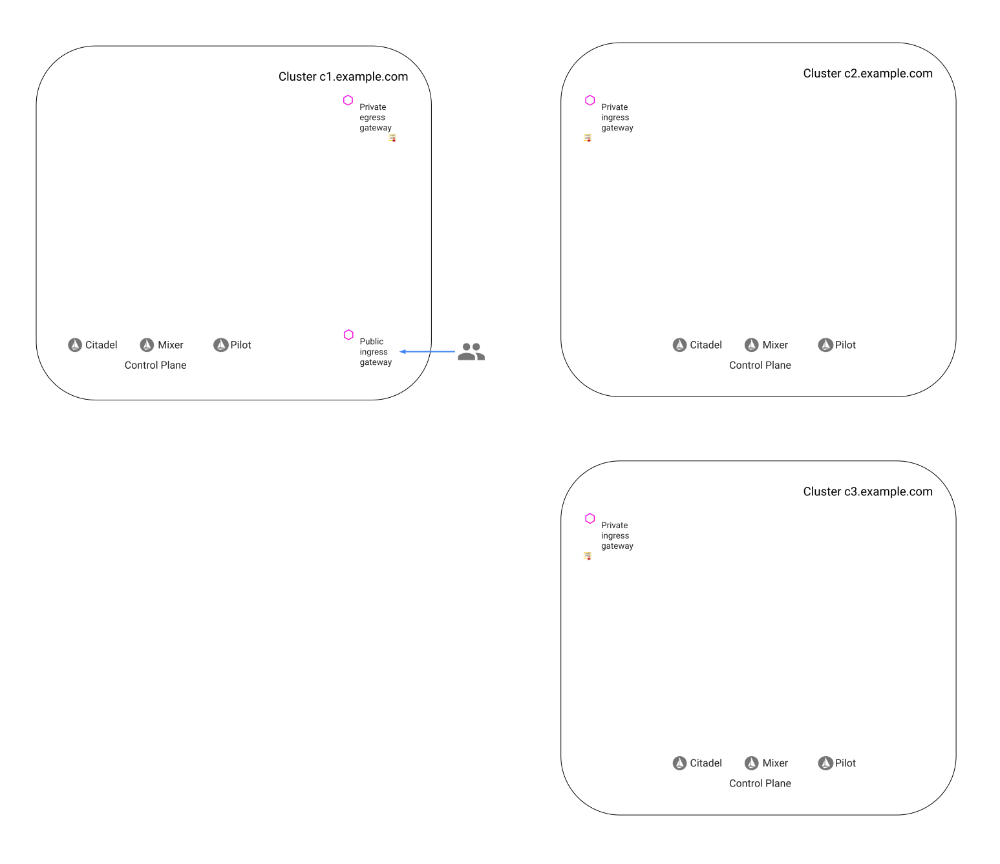

### Prerequisites for three clusters

Three Kubernetes clusters with default Istio installations, referenced below as `cluster1`, `cluster2` and `cluster3`.
`cluster1` will consume services exposed from `cluster2` and `cluster3`.

1.  Store the context names of your clusters in environment variables:

    ```bash
    export CTX_CLUSTER1=$(kubectl config view -o jsonpath='{.contexts[0].name}')
    export CTX_CLUSTER2=$(kubectl config view -o jsonpath='{.contexts[1].name}')
    export CTX_CLUSTER3=$(kubectl config view -o jsonpath='{.contexts[2].name}')
    echo CTX_CLUSTER1 = ${CTX_CLUSTER1}, CTX_CLUSTER2 = ${CTX_CLUSTER2}, CTX_CLUSTER3 = ${CTX_CLUSTER3}
    CTX_CLUSTER1 = cluster1, CTX_CLUSTER2 = cluster2, CTX_CLUSTER3 = cluster1
    ```

1.  Set global mutual TLS in all the three clusters:

    ```bash
    kubectl apply --context=$CTX_CLUSTER1 -f - <<EOF
    apiVersion: "authentication.istio.io/v1alpha1"
    kind: "MeshPolicy"
    metadata:
     name: "default"
    spec:
     peers:
     - mtls: {}
    EOF
    ```

    ```bash
    kubectl apply --context=$CTX_CLUSTER2 -f - <<EOF
    apiVersion: "authentication.istio.io/v1alpha1"
    kind: "MeshPolicy"
    metadata:
     name: "default"
    spec:
     peers:
     - mtls: {}
    EOF
    ```

    ```bash
    kubectl apply --context=$CTX_CLUSTER3 -f - <<EOF
    apiVersion: "authentication.istio.io/v1alpha1"
    kind: "MeshPolicy"
    metadata:
     name: "default"
    spec:
     peers:
     - mtls: {}
    EOF
    ```

## Setup

### Generate certificates and keys for all the clusters

You can use the command of your choice to generate certificates and keys, the command below use
[openssl](https://man.openbsd.org/openssl.1).

1.  Create an `openssl` configuration file for `cluster1`:

    ```bash
    cat > ./certificate1.conf <<EOF
    [ req ]
    encrypt_key = no
    prompt = no
    utf8 = yes
    default_md = sha256
    req_extensions = req_ext
    x509_extensions = req_ext
    distinguished_name = req_dn
    [ req_ext ]
    subjectKeyIdentifier = hash
    basicConstraints = critical, CA:false
    keyUsage = critical, digitalSignature, nonRepudiation
    extendedKeyUsage = clientAuth
    subjectAltName = critical, @san
    [req_dn]
    O=example Inc., department 1
    CN=c1.example.com
    [ san ]
    URI.1 = spiffe://c1.example.com/istio-private-egressgateway
    EOF
    ```

1.  Create a configuration file for `cluster2`:

    ```bash
    cat > ./certificate2.conf <<EOF
    [ req ]
    encrypt_key = no
    prompt = no
    utf8 = yes
    default_md = sha256
    req_extensions = req_ext
    x509_extensions = req_ext
    distinguished_name = req_dn
    [ req_ext ]
    subjectKeyIdentifier = hash
    basicConstraints = critical, CA:false
    keyUsage = critical, digitalSignature, nonRepudiation
    extendedKeyUsage = serverAuth
    subjectAltName = critical, @san
    [req_dn]
    O=example Inc., department 2
    CN=c2.example.com
    [ san ]
    URI.1 = spiffe://c2.example.com/istio-private-ingressgateway
    EOF
    ```

1.  Create a configuration file for `cluster3`.

    ```bash
    cat > ./certificate3.conf <<EOF
    [ req ]
    encrypt_key = no
    prompt = no
    utf8 = yes
    default_md = sha256
    req_extensions = req_ext
    x509_extensions = req_ext
    distinguished_name = req_dn
    [ req_ext ]
    subjectKeyIdentifier = hash
    basicConstraints = critical, CA:false
    keyUsage = critical, digitalSignature, nonRepudiation
    extendedKeyUsage = serverAuth
    subjectAltName = critical, @san
    [req_dn]
    O=example Inc., department 3
    CN=c3.example.com
    [ san ]
    URI.1 = spiffe://c3.example.com/istio-private-egressgateway
    EOF
    ```

1.  Create an `openssl` configuration file for `cluster4` (used for testing RBAC, not for an actual cluster):

    ```bash
    cat > ./certificate4.conf <<EOF
    [ req ]
    encrypt_key = no
    prompt = no
    utf8 = yes
    default_md = sha256
    req_extensions = req_ext
    x509_extensions = req_ext
    distinguished_name = req_dn
    [ req_ext ]
    subjectKeyIdentifier = hash
    basicConstraints = critical, CA:false
    keyUsage = critical, digitalSignature, nonRepudiation
    extendedKeyUsage = clientAuth
    subjectAltName = critical, @san
    [req_dn]
    O=example Inc., department 4
    CN=c1.example.com
    [ san ]
    URI.1 = spiffe://c4.example.com/istio-private-egressgateway
    EOF
    ```

1.  Create the certificates and the keys:

    ```bash
    openssl req -x509 -sha256 -nodes -days 365 -newkey rsa:2048 -subj '/O=example Inc./CN=example.com' -keyout example.com.key -out example.com.crt
    openssl req -reqexts req_ext -out c1.example.com.csr -newkey rsa:2048 -nodes -keyout c1.example.com.key -config ./certificate1.conf
    openssl x509 -req -days 365 -CA example.com.crt -CAkey example.com.key -set_serial 0 -in c1.example.com.csr -out c1.example.com.crt -extensions req_ext -extfile ./certificate1.conf
    openssl req -reqexts req_ext -out c2.example.com.csr -newkey rsa:2048 -nodes -keyout c2.example.com.key -config ./certificate2.conf
    openssl x509 -req -days 365 -CA example.com.crt -CAkey example.com.key -set_serial 1 -in c2.example.com.csr -out c2.example.com.crt -extensions req_ext -extfile ./certificate2.conf
    openssl req -reqexts req_ext -out c3.example.com.csr -newkey rsa:2048 -nodes -keyout c3.example.com.key -config ./certificate3.conf
    openssl x509 -req -days 365 -CA example.com.crt -CAkey example.com.key -set_serial 2 -in c3.example.com.csr -out c3.example.com.crt -extensions req_ext -extfile ./certificate3.conf
    openssl req -reqexts req_ext -out c4.example.com.csr -newkey rsa:2048 -nodes -keyout c4.example.com.key -config ./certificate4.conf
    openssl x509 -req -days 365 -CA example.com.crt -CAkey example.com.key -set_serial 3 -in c4.example.com.csr -out c4.example.com.crt -extensions req_ext -extfile ./certificate4.conf
    ```

### Deploy a private egress gateway in the first cluster

1.  Create the `istio-private-gateways` namespace:

    ```bash
    kubectl apply --context=$CTX_CLUSTER1 -f - <<EOF
    apiVersion: v1
    kind: Namespace
    metadata:
      name: istio-private-gateways
    EOF
    ```

1. Create Kubernetes [Secrets](https://kubernetes.io/docs/concepts/configuration/secret/) to hold the gateways's
   certificates and keys.

    ```bash
    kubectl create --context=$CTX_CLUSTER1 -n istio-private-gateways secret tls c1-example-com-certs --key c1.example.com.key --cert c1.example.com.crt
    kubectl create --context=$CTX_CLUSTER1 -n istio-private-gateways secret generic c1-trusted-certs --from-file=example.com.crt
    ```

1.  Deploy a private egress gateway and mount the new secrets as data volumes by the following command:

    ```bash
    cat <<EOF | helm template install/kubernetes/helm/istio/ --name istio --namespace istio-private-gateways -x charts/gateways/templates/deployment.yaml -x charts/gateways/templates/service.yaml -x charts/gateways/templates/serviceaccount.yaml -x charts/gateways/templates/autoscale.yaml -x charts/gateways/templates/role.yaml -x charts/gateways/templates/rolebindings.yaml --set global.istioNamespace=istio-system -f - | kubectl apply --context=$CTX_CLUSTER1 -f -
    gateways:
      enabled: true
      istio-egressgateway:
        enabled: false
      istio-ingressgateway:
        enabled: false
      istio-private-egressgateway:
        enabled: true
        labels:
          app: istio-private-egressgateway
          istio: private-egressgateway
        replicaCount: 1
        autoscaleMin: 1
        autoscaleMax: 5
        cpu:
          targetAverageUtilization: 80
        type: ClusterIP
        ports:
        - port: 80
          name: http
        - port: 443
          name: https
        - port: 15444
          name: tls-for-cross-cluster-communication
        - port: 31400
          name: tcp-1
        - port: 31401
          name: tcp-2
        secretVolumes:
        - name: c1-example-com-certs
          secretName: c1-example-com-certs
          mountPath: /etc/istio/c1.example.com/certs
        - name: c1-trusted-certs
          secretName: c1-trusted-certs
          mountPath: /etc/istio/example.com/certs
    EOF
    ```

1.  Verify that the egress gateway's pod is running:

    ```bash
    kubectl get pods $(kubectl get pod -l istio=private-egressgateway -n istio-private-gateways -o jsonpath='{.items..metadata.name}' --context=$CTX_CLUSTER1)  -n istio-private-gateways --context=$CTX_CLUSTER1
    NAME                                           READY   STATUS    RESTARTS   AGE
    istio-private-egressgateway-586c8cb5db-5m77h   1/1     Running   0          43s
    ```

1.  Verify that the key and the certificates are successfully loaded in the egress gateway's pod:

    ```bash
    kubectl exec -it $(kubectl get pod -l istio=private-egressgateway -n istio-private-gateways -o jsonpath='{.items..metadata.name}' --context=$CTX_CLUSTER1)  -n istio-private-gateways --context=$CTX_CLUSTER1 -- ls -al /etc/istio/c1.example.com/certs /etc/istio/example.com/certs
    /etc/istio/c1.example.com/certs:
    total 4
    drwxrwxrwt 3 root root  120 Jul 29 00:27 .
    drwxr-xr-x 3 root root 4096 Jul 29 00:27 ..
    drwxr-xr-x 2 root root   80 Jul 29 00:27 ..2019_07_29_00_27_05.153388454
    lrwxrwxrwx 1 root root   31 Jul 29 00:27 ..data -> ..2019_07_29_00_27_05.153388454
    lrwxrwxrwx 1 root root   14 Jul 29 00:27 tls.crt -> ..data/tls.crt
    lrwxrwxrwx 1 root root   14 Jul 29 00:27 tls.key -> ..data/tls.key

    /etc/istio/example.com/certs:
    total 4
    drwxrwxrwt 3 root root  100 Jul 29 00:27 .
    drwxr-xr-x 3 root root 4096 Jul 29 00:27 ..
    drwxr-xr-x 2 root root   60 Jul 29 00:27 ..2019_07_29_00_27_05.678454477
    lrwxrwxrwx 1 root root   31 Jul 29 00:27 ..data -> ..2019_07_29_00_27_05.678454477
    lrwxrwxrwx 1 root root   22 Jul 29 00:27 example.com.crt -> ..data/example.com.crt
    ```

### Deploy a private ingress gateway in the second cluster

1.  Create the `istio-private-gateways` namespace:

    ```bash
    kubectl apply --context=$CTX_CLUSTER2 -f - <<EOF
    apiVersion: v1
    kind: Namespace
    metadata:
      name: istio-private-gateways
    EOF
    ```

1.  Create Kubernetes [Secrets](https://kubernetes.io/docs/concepts/configuration/secret/) to hold the gateways's
    certificates and keys.

    ```bash
    kubectl create --context=$CTX_CLUSTER2 -n istio-private-gateways secret tls c2-example-com-certs --key c2.example.com.key --cert c2.example.com.crt
    kubectl create --context=$CTX_CLUSTER2 -n istio-private-gateways secret generic c2-trusted-certs --from-file=example.com.crt
    ```

1.  Deploy a private ingress gateway and mount the new secrets as data volumes by the following command:

    ```bash
    cat <<EOF | helm template install/kubernetes/helm/istio/ --name istio --namespace istio-private-gateways -x charts/gateways/templates/deployment.yaml -x charts/gateways/templates/service.yaml -x charts/gateways/templates/serviceaccount.yaml -x charts/gateways/templates/autoscale.yaml -x charts/gateways/templates/role.yaml -x charts/gateways/templates/rolebindings.yaml --set global.istioNamespace=istio-system -f - | kubectl apply --context=$CTX_CLUSTER2 -f -
    gateways:
      enabled: true
      istio-egressgateway:
        enabled: false
      istio-ingressgateway:
        enabled: false
      istio-private-ingressgateway:
        enabled: true
        labels:
          app: istio-private-ingressgateway
          istio: private-ingressgateway
        replicaCount: 1
        autoscaleMin: 1
        autoscaleMax: 5
        cpu:
          targetAverageUtilization: 80
        type: LoadBalancer
        ports:
        - port: 15443
          name: https-for-cross-cluster-communication
        - port: 15444
          name: tls-for-cross-cluster-communication
        - port: 31400
          name: tcp-1
        - port: 31401
          name: tcp-2
        secretVolumes:
        - name: c2-example-com-certs
          secretName: c2-example-com-certs
          mountPath: /etc/istio/c2.example.com/certs
        - name: c2-trusted-certs
          secretName: c2-trusted-certs
          mountPath: /etc/istio/example.com/certs
    EOF
    ```

1.  Verify that the ingress gateway's pod is running:

    ```bash
    kubectl get pods $(kubectl get pod -l istio=private-ingressgateway -n istio-private-gateways -o jsonpath='{.items..metadata.name}' --context=$CTX_CLUSTER2)  -n istio-private-gateways --context=$CTX_CLUSTER2
    NAME                                            READY   STATUS    RESTARTS   AGE
    istio-private-ingressgateway-546fccbcdd-2w8n7   1/1     Running   0          2m51s
    ```

1.  Verify that the key and the certificate are successfully loaded in the ingress gateway's pod:

    ```bash
    kubectl exec -it $(kubectl get pod -l istio=private-ingressgateway -n istio-private-gateways -o jsonpath='{.items..metadata.name}' --context=$CTX_CLUSTER2)  -n istio-private-gateways --context=$CTX_CLUSTER2 -- ls -al /etc/istio/c2.example.com/certs /etc/istio/example.com/certs
    /etc/istio/c2.example.com/certs:
    total 4
    drwxrwxrwt 3 root root  120 Jul 29 00:35 .
    drwxr-xr-x 3 root root 4096 Jul 29 00:35 ..
    drwxr-xr-x 2 root root   80 Jul 29 00:35 ..2019_07_29_00_35_10.417805046
    lrwxrwxrwx 1 root root   31 Jul 29 00:35 ..data -> ..2019_07_29_00_35_10.417805046
    lrwxrwxrwx 1 root root   14 Jul 29 00:35 tls.crt -> ..data/tls.crt
    lrwxrwxrwx 1 root root   14 Jul 29 00:35 tls.key -> ..data/tls.key

    /etc/istio/example.com/certs:
    total 4
    drwxrwxrwt 3 root root  100 Jul 29 00:35 .
    drwxr-xr-x 3 root root 4096 Jul 29 00:35 ..
    drwxr-xr-x 2 root root   60 Jul 29 00:35 ..2019_07_29_00_35_10.932595677
    lrwxrwxrwx 1 root root   31 Jul 29 00:35 ..data -> ..2019_07_29_00_35_10.932595677
    lrwxrwxrwx 1 root root   22 Jul 29 00:35 example.com.crt -> ..data/example.com.crt
    ```

### Deploy a private ingress gateway in the third cluster

1.  Create the `istio-private-gateways` namespace:

    ```bash
    kubectl apply --context=$CTX_CLUSTER3 -f - <<EOF
    apiVersion: v1
    kind: Namespace
    metadata:
      name: istio-private-gateways
    EOF
    ```

1.  Create Kubernetes [Secrets](https://kubernetes.io/docs/concepts/configuration/secret/) to hold the gateways's
    certificates and keys.

    ```bash
    kubectl create --context=$CTX_CLUSTER3 -n istio-private-gateways secret tls c3-example-com-certs --key c3.example.com.key --cert c3.example.com.crt
    kubectl create --context=$CTX_CLUSTER3 -n istio-private-gateways secret generic c3-trusted-certs --from-file=example.com.crt
    ```

1.  Deploy a private ingress gateway and mount the new secrets as data volumes by the following command:

    ```bash
    cat <<EOF | helm template install/kubernetes/helm/istio/ --name istio --namespace istio-private-gateways -x charts/gateways/templates/deployment.yaml -x charts/gateways/templates/service.yaml -x charts/gateways/templates/serviceaccount.yaml -x charts/gateways/templates/autoscale.yaml -x charts/gateways/templates/role.yaml -x charts/gateways/templates/rolebindings.yaml --set global.istioNamespace=istio-system -f - | kubectl apply --context=$CTX_CLUSTER3 -f -
    gateways:
      enabled: true
      istio-egressgateway:
        enabled: false
      istio-ingressgateway:
        enabled: false
      istio-private-ingressgateway:
        enabled: true
        labels:
          app: istio-private-ingressgateway
          istio: private-ingressgateway
        replicaCount: 1
        autoscaleMin: 1
        autoscaleMax: 5
        cpu:
          targetAverageUtilization: 80
        type: LoadBalancer
        ports:
        - port: 15443
          name: https-for-cross-cluster-communication
        - port: 15444
          name: tls-for-cross-cluster-communication
        - port: 31400
          name: tcp-1
        - port: 31401
          name: tcp-2
        secretVolumes:
        - name: c3-example-com-certs
          secretName: c3-example-com-certs
          mountPath: /etc/istio/c3.example.com/certs
        - name: c3-trusted-certs
          secretName: c3-trusted-certs
          mountPath: /etc/istio/example.com/certs
    EOF
    ```

1.  Verify that the ingress gateway's pod is running:

    ```bash
    kubectl get pods $(kubectl get pod -l istio=private-ingressgateway -n istio-private-gateways -o jsonpath='{.items..metadata.name}' --context=$CTX_CLUSTER3)  -n istio-private-gateways --context=$CTX_CLUSTER3
    NAME                                            READY   STATUS    RESTARTS   AGE
    istio-private-ingressgateway-546fccbcdd-2w8n7   1/1     Running   0          2m51s
    ```

1.  Verify that the key and the certificate are successfully loaded in the ingress gateway's pod:

    ```bash
    kubectl exec -it $(kubectl get pod -l istio=private-ingressgateway -n istio-private-gateways -o jsonpath='{.items..metadata.name}' --context=$CTX_CLUSTER3)  -n istio-private-gateways --context=$CTX_CLUSTER3 -- ls -al /etc/istio/c3.example.com/certs /etc/istio/example.com/certs
    /etc/istio/c3s.example.com/certs:
    total 4
    drwxrwxrwt 3 root root  120 Jul 29 00:35 .
    drwxr-xr-x 3 root root 4096 Jul 29 00:35 ..
    drwxr-xr-x 2 root root   80 Jul 29 00:35 ..2019_07_29_00_35_10.417805046
    lrwxrwxrwx 1 root root   31 Jul 29 00:35 ..data -> ..2019_07_29_00_35_10.417805046
    lrwxrwxrwx 1 root root   14 Jul 29 00:35 tls.crt -> ..data/tls.crt
    lrwxrwxrwx 1 root root   14 Jul 29 00:35 tls.key -> ..data/tls.key

    /etc/istio/example.com/certs:
    total 4
    drwxrwxrwt 3 root root  100 Jul 29 00:35 .
    drwxr-xr-x 3 root root 4096 Jul 29 00:35 ..
    drwxr-xr-x 2 root root   60 Jul 29 00:35 ..2019_07_29_00_35_10.932595677
    lrwxrwxrwx 1 root root   31 Jul 29 00:35 ..data -> ..2019_07_29_00_35_10.932595677
    lrwxrwxrwx 1 root root   22 Jul 29 00:35 example.com.crt -> ..data/example.com.crt
    ```

### Configure environment variables to access the clusters

1.  Execute the following command to determine if your second and third clusters are running in environments that support
   external load balancers:

    ```bash
    kubectl get svc istio-private-ingressgateway -n istio-private-gateways --context=$CTX_CLUSTER2
    kubectl get svc istio-private-ingressgateway -n istio-private-gateways --context=$CTX_CLUSTER3
    NAME                   TYPE           CLUSTER-IP       EXTERNAL-IP     PORT(S)                                      AGE
    istio-ingressgateway   LoadBalancer   172.21.109.129   130.211.10.121  80:31380/TCP,443:31390/TCP,31400:31400/TCP   17h
    NAME                   TYPE           CLUSTER-IP       EXTERNAL-IP     PORT(S)                                      AGE
    istio-ingressgateway   LoadBalancer   172.21.108.128   130.211.11.120  80:31380/TCP,443:31390/TCP,31400:31400/TCP   17h
    ```

    If the `EXTERNAL-IP` value is set, your environment has an external load balancer that you can use for the ingress gateway.
    If the `EXTERNAL-IP` value is `<none>` (or perpetually `<pending>`), your environment does not provide an external load balancer for the ingress gateway.
    In this case, you can access the gateway using the service's [node port](https://kubernetes.io/docs/concepts/services-networking/service/#nodeport).

1.  In case you have load balancers, set the private ingress IP and ports for the second and third clusters by running the
    commands below. Otherwise, read
    [the instructions for using a node port for ingress](https://istio.io/docs/tasks/traffic-management/ingress/ingress-control/#determining-the-ingress-ip-and-ports) and adapt them for your private ingress gateway.

    ```bash
    export CLUSTER2_INGRESS_HOST=$(kubectl -n istio-private-gateways get service istio-private-ingressgateway --context=$CTX_CLUSTER2 -o jsonpath='{.status.loadBalancer.ingress[0].ip}')
    export CLUSTER2_SECURE_INGRESS_PORT=$(kubectl -n istio-private-gateways get service istio-private-ingressgateway --context=$CTX_CLUSTER2 -o jsonpath='{.spec.ports[?(@.name=="https-for-cross-cluster-communication")].port}')
    export CLUSTER3_INGRESS_HOST=$(kubectl -n istio-private-gateways get service istio-private-ingressgateway --context=$CTX_CLUSTER3 -o jsonpath='{.status.loadBalancer.ingress[0].ip}')
    export CLUSTER3_SECURE_INGRESS_PORT=$(kubectl -n istio-private-gateways get service istio-private-ingressgateway --context=$CTX_CLUSTER3 -o jsonpath='{.spec.ports[?(@.name=="https-for-cross-cluster-communication")].port}')
    ```

## The diagram of the accomplished setup


*The three clusters with the deployed gateways*

## Cleanup

### Delete the private gateway in the first cluster

1.  Undeploy the private egress gateway from `cluster1`:

    ```bash
    kubectl delete --context=$CTX_CLUSTER1 -n istio-private-gateways deployment istio-private-egressgateway --ignore-not-found=true
    kubectl delete --context=$CTX_CLUSTER1 -n istio-private-gateways service istio-private-egressgateway --ignore-not-found=true
    kubectl delete --context=$CTX_CLUSTER1 -n istio-private-gateways serviceaccount istio-private-egressgateway-service-account --ignore-not-found=true
    ```

1.  Delete the secrets from `cluster1`:

    ```bash
    kubectl delete --context=$CTX_CLUSTER1 -n istio-private-gateways secrets c1-example-com-certs c1-trusted-certs --ignore-not-found=true
    ```

1.  Delete the `istio-private-gateways` namespace from `cluster1`:

    ```bash
    kubectl delete --context=$CTX_CLUSTER1 namespace istio-private-gateways --ignore-not-found=true
    ```

### Delete the private gateway in the second cluster

1.  Undeploy the private ingress gateway from `cluster2`:

    ```bash
    kubectl delete --context=$CTX_CLUSTER2 -n istio-private-gateways deployment istio-private-ingressgateway --ignore-not-found=true
    kubectl delete --context=$CTX_CLUSTER2 -n istio-private-gateways service istio-private-ingressgateway --ignore-not-found=true
    kubectl delete --context=$CTX_CLUSTER2 -n istio-private-gateways serviceaccount istio-private-ingressgateway-service-account --ignore-not-found=true
    ```

1.  Delete the secrets from `cluster2`:

    ```bash
    kubectl delete --context=$CTX_CLUSTER2 -n istio-private-gateways secrets c2-example-com-certs c2-trusted-certs --ignore-not-found=true
    ```

1.  Delete the `istio-private-gateways` namespace from `cluster2`:

    ```bash
    kubectl delete --context=$CTX_CLUSTER2 namespace istio-private-gateways --ignore-not-found=true
    ```

### Delete the private gateway in the third cluster

1.  Undeploy the private ingress gateway from `cluster3`:

    ```bash
    kubectl delete --context=$CTX_CLUSTER3 -n istio-private-gateways deployment istio-private-ingressgateway --ignore-not-found=true
    kubectl delete --context=$CTX_CLUSTER3 -n istio-private-gateways service istio-private-ingressgateway --ignore-not-found=true
    kubectl delete --context=$CTX_CLUSTER3 -n istio-private-gateways serviceaccount istio-private-ingressgateway-service-account --ignore-not-found=true
    ```

1.  Delete the secrets from `cluster3`:

    ```bash
    kubectl delete --context=$CTX_CLUSTER3 -n istio-private-gateways secrets c3-example-com-certs c3-trusted-certs --ignore-not-found=true
    ```

1.  Delete the `istio-private-gateways` namespace from `cluster2`:

    ```bash
    kubectl delete --context=$CTX_CLUSTER3 namespace istio-private-gateways --ignore-not-found=true
    ```

### Delete the certificates and keys

```bash
rm example.com.crt
rm certificate1.conf c1.example.com.crt c1.example.com.csr c1.example.com.key
rm certificate2.conf c2.example.com.crt c2.example.com.csr c2.example.com.key
rm certificate3.conf c3.example.com.crt c3.example.com.csr c3.example.com.key
rm certificate4.conf c4.example.com.crt c4.example.com.csr c4.example.com.key
```

### Unset environment variables

```bash
unset CTX_CLUSTER1 CTX_CLUSTER2 CTX_CLUSTER3 CLUSTER2_INGRESS_HOST CLUSTER2_SECURE_INGRESS_PORT CLUSTER3_INGRESS_HOST CLUSTER3_SECURE_INGRESS_PORT
```
