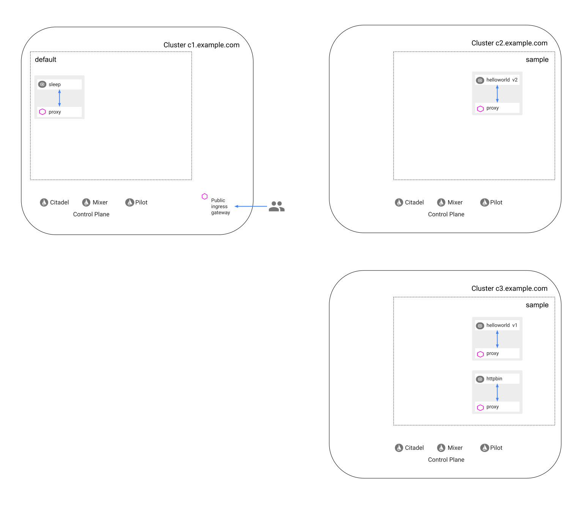
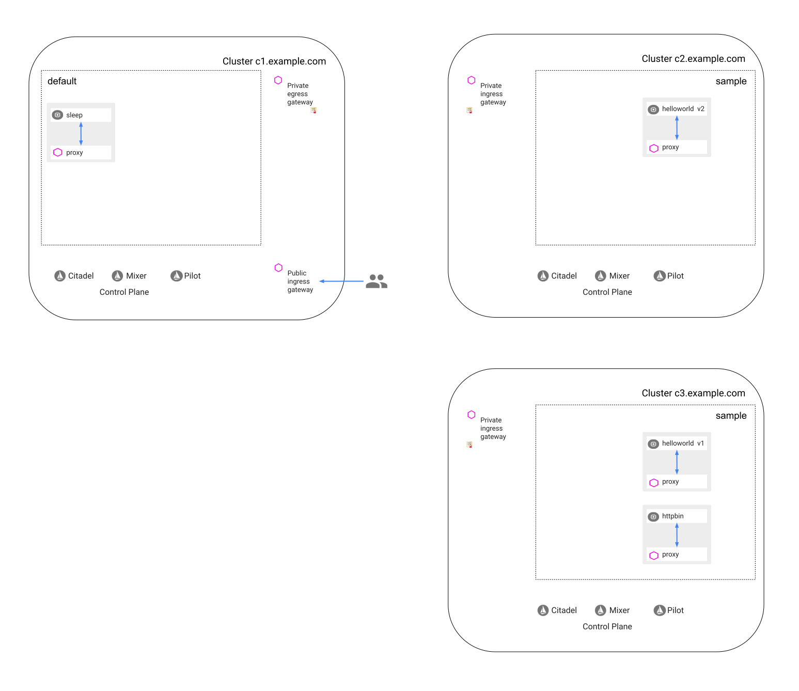
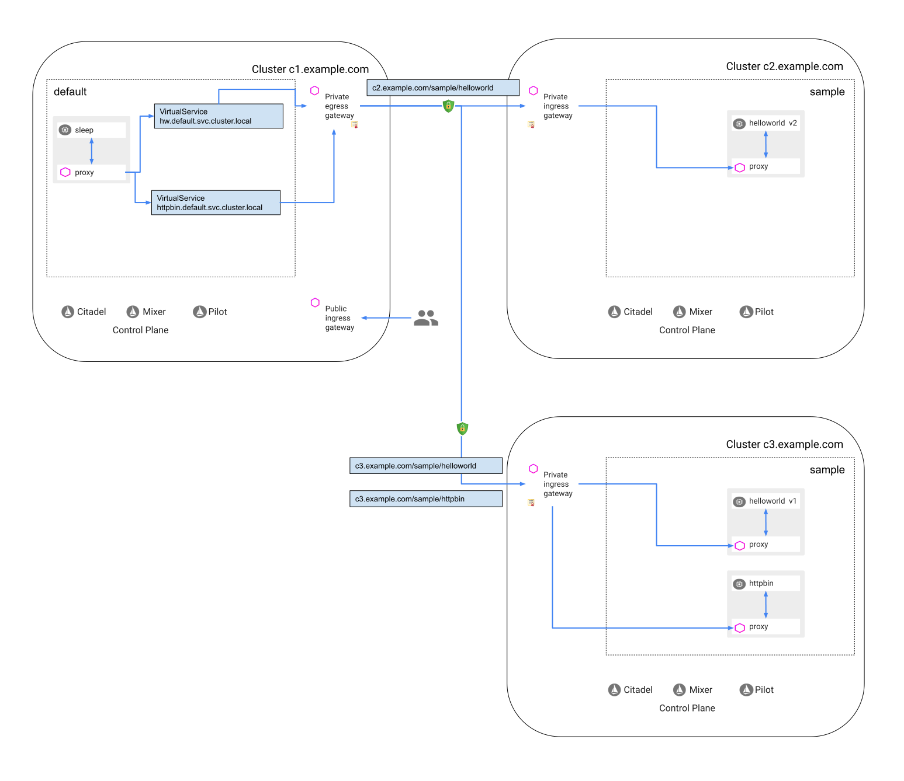

### Prerequisites for three clusters

See [Prerequisites for three clusters](/docs/examples/multimesh/multimesh-common-setup/#prerequisites-for-three-clusters)
in [common multi-mesh setup](/docs/examples/multimesh/multimesh-common-setup).

## Initial setup

In each of the clusters, deploy the [sleep](/samples/sleep) sample app to use as a test source for
sending requests.

```bash
kubectl apply -f @samples/sleep/sleep.yaml--context=$CTX_CLUSTER1
kubectl apply -f @samples/sleep/sleep.yaml--context=$CTX_CLUSTER2
kubectl apply -f @samples/sleep/sleep.yaml--context=$CTX_CLUSTER3
```

## Deploy hello world samples in the second and third clusters

### Deploy helloworld v2 in the second cluster

1.  Create a `sample` namespace with a sidecar auto-injection label:

    ```bash
    kubectl create --context=$CTX_CLUSTER2 ns sample
    kubectl label --context=$CTX_CLUSTER2 namespace sample istio-injection=enabled
    ```

1.  Deploy `helloworld v2`:

    ```bash
    kubectl create --context=$CTX_CLUSTER2 -f @samples/helloworld/helloworld.yaml-l app=helloworld -n sample
    kubectl create --context=$CTX_CLUSTER2 -f @samples/helloworld/helloworld.yaml-l version=v2 -n sample
    ```

1.  Create a destination rule for `helloworld`:

    ```bash
    kubectl apply --context=$CTX_CLUSTER2 -n sample -f - <<EOF
    apiVersion: networking.istio.io/v1alpha3
    kind: DestinationRule
    metadata:
      name: helloworld
    spec:
      host: helloworld
      trafficPolicy:
        tls:
          mode: ISTIO_MUTUAL
      subsets:
      - name: v2
        labels:
          version: v2
    EOF
    ```

1.  Confirm `helloworld v2` is running:

    ```bash
    kubectl get po --context=$CTX_CLUSTER2 -n sample
    NAME                             READY     STATUS    RESTARTS   AGE
    helloworld-v2-7dd57c44c4-f56gq   2/2       Running   0          35s
    ```

1.  Check that the service is accessible with the cluster. Send a GET request from `sleep` to `helloworld`:

    ```bash
     kubectl exec -it $(kubectl get pod -l app=sleep --context=$CTX_CLUSTER2 -n default -o jsonpath='{.items[0].metadata.name}') --context=$CTX_CLUSTER2 -n default -c sleep -- curl helloworld.sample.svc.cluster.local:5000/hello -w "\nResponse code: %{http_code}\n"
    Hello version: v2, instance: helloworld-v2-6cd449dff4-n7s48

    Response code: 200
    ```

### Deploy helloworld v1 in the third cluster

1.  Create a `sample` namespace with a sidecar auto-injection label:

    ```bash
    kubectl create --context=$CTX_CLUSTER3 ns sample
    kubectl label --context=$CTX_CLUSTER3 namespace sample istio-injection=enabled
    ```

1.  Deploy `helloworld v1`:

    ```bash
    kubectl create --context=$CTX_CLUSTER3 -f @samples/helloworld/helloworld.yaml-l app=helloworld -n sample
    kubectl create --context=$CTX_CLUSTER3 -f @samples/helloworld/helloworld.yaml-l version=v1 -n sample
    ```

1.  Create a destination rule for `helloworld`:

    ```bash
    kubectl apply --context=$CTX_CLUSTER3 -n sample -f - <<EOF
    apiVersion: networking.istio.io/v1alpha3
    kind: DestinationRule
    metadata:
      name: helloworld
    spec:
      host: helloworld
      trafficPolicy:
        tls:
          mode: ISTIO_MUTUAL
      subsets:
      - name: v1
        labels:
          version: v1
    EOF
    ```

1.  Deploy the [httpbin](/samples/httpbin) sample:

    ```bash
    kubectl create --context=$CTX_CLUSTER3 -f @samples/httpbin/httpbin.yaml-n sample
    ```

1.  Create a destination rule for `httpbin`:

    ```bash
    kubectl apply --context=$CTX_CLUSTER3 -n sample -f - <<EOF
    apiVersion: networking.istio.io/v1alpha3
    kind: DestinationRule
    metadata:
      name: httpbin
    spec:
      host: httpbin
      trafficPolicy:
        tls:
          mode: ISTIO_MUTUAL
    EOF
    ```

1.  Confirm `helloworld v1` and `httpbin` running:

    ```bash
    kubectl get po --context=$CTX_CLUSTER3 -n sample
    NAME                            READY     STATUS    RESTARTS   AGE
    helloworld-v1-d4557d97b-pv2hr   2/2       Running   0          40s
    httpbin-5446f4d9b4-sm6jm        2/2       Running   0          40s
    ```

1.  Check that the services are accessible within the cluster. Send a GET request from `sleep` to `helloworld`.
    (Note that `helloworld` in the third cluster returns `version v1`, while `helloworld` in the second cluster returns
     `version v2`)

    ```bash
    kubectl exec -it $(kubectl get pod -l app=sleep --context=$CTX_CLUSTER3 -n default -o jsonpath='{.items[0].metadata.name}') --context=$CTX_CLUSTER3 -n default -c sleep -- curl helloworld.sample.svc.cluster.local:5000/hello -w "\nResponse code: %{http_code}\n"
    Hello version: v1, instance: helloworld-v1-7bb88866c4-qvmzm

    Response code: 200
    ```

1.  Send a GET request from `sleep` to `httpbin`:

    ```bash
    kubectl exec -it $(kubectl get pod -l app=sleep --context=$CTX_CLUSTER3 -n default -o jsonpath='{.items[0].metadata.name}') --context=$CTX_CLUSTER3 -n default -c sleep -- curl httpbin.sample.svc.cluster.local:8000/status/418 -w "\nResponse code: %{http_code}\n"
    -=[ teapot ]=-

       _...._
     .'  _ _ `.
    | ."` ^ `". _,
    \_;`"---"`|//
      |       ;/
      \_     _/
        `"""`

    Response code: 418
    ```

After completing the steps until now, you get the following setting:


*The three clusters with the deployed services*

## Perform one-time setup

Follow the instructions in the [Setup](/docs/examples/multimesh/multimesh-common-setup/#setup) section of [common multi-mesh setup](/docs/examples/multimesh/multimesh-common-setup).

Once you finish the instructions above, you get the following setting:


*The three clusters with the deployed services and gateways*

## Expose and consume services (on a per-service basis)

### Expose hello world v2 in the second cluster

1.  Define an ingress `Gateway`:

    ```bash
    kubectl apply --context=$CTX_CLUSTER2 -n istio-private-gateways -f - <<EOF
    apiVersion: networking.istio.io/v1alpha3
    kind: Gateway
    metadata:
      name: istio-private-ingressgateway
    spec:
      selector:
        istio: private-ingressgateway
      servers:
      - port:
          number: 15443
          name: https
          protocol: HTTPS
        tls:
          mode: MUTUAL
          serverCertificate: /etc/istio/c2.example.com/certs/tls.crt
          privateKey: /etc/istio/c2.example.com/certs/tls.key
          caCertificates: /etc/istio/example.com/certs/example.com.crt
        hosts:
        - "*"
    EOF
    ```

1.  Configure routing to `helloworld v2`:

    ```bash
    kubectl apply --context=$CTX_CLUSTER2 -n istio-private-gateways -f - <<EOF
    apiVersion: networking.istio.io/v1alpha3
    kind: VirtualService
    metadata:
      name: privately-exposed-services
    spec:
      hosts:
      - "*"
      gateways:
      - istio-private-ingressgateway
      http:
      - match:
        - uri:
            prefix: /sample/helloworld/
        rewrite:
          uri: /
          authority: helloworld.sample.svc.cluster.local
        route:
        - destination:
            port:
              number: 5000
            host: helloworld.sample.svc.cluster.local
            subset: v2
    EOF
    ```

1.  Test your configuration by accessing the exposed service. The `curl` command below uses the certificate and the
    private key of `cluster1`:

    ```bash
    curl -HHost:c2.example.com --resolve c2.example.com:$CLUSTER2_SECURE_INGRESS_PORT:$CLUSTER2_INGRESS_HOST --cacert example.com.crt --key c1.example.com.key --cert c1.example.com.crt https://c2.example.com:$CLUSTER2_SECURE_INGRESS_PORT/sample/helloworld/hello -w "\nResponse code: %{http_code}\n"
    Hello version: v2, instance: helloworld-v2-6cd449dff4-r9bl9

    Response code: 200
    ```

### Consume helloworld v2 in the first cluster

Bind `helloworld` exposed from `cluster2` as `hw.default.svc.cluster.local` in `cluster1`. Note that the name of the
service in `cluster1` is different from the name of the service in `cluster2`.

1.  Create a Kubernetes service for `c2.example.com` since it is not an existing hostname. In the real life, you
    would use the real hostname of your cluster.

    ```bash
    kubectl apply --context=$CTX_CLUSTER1 -n istio-private-gateways -f - <<EOF
    kind: Service
    apiVersion: v1
    metadata:
      name: c2-example-com
    spec:
      ports:
      - protocol: TCP
        port: 15443
        name: tls-for-cross-cluster-communication
    EOF
    ```

1.  Create an endpoint for `c2.example.com`:

    ```bash
    kubectl apply --context=$CTX_CLUSTER1 -n istio-private-gateways -f - <<EOF
    kind: Endpoints
    apiVersion: v1
    metadata:
      name: c2-example-com
    subsets:
      - addresses:
          - ip: $CLUSTER2_INGRESS_HOST
        ports:
          - port: 15443
            name: tls-for-cross-cluster-communication
    EOF
    ```

1.  Create a destination rule for `c2.example.com`:

    ```bash
    kubectl apply --context=$CTX_CLUSTER1 -n istio-private-gateways -f - <<EOF
    apiVersion: networking.istio.io/v1alpha3
    kind: DestinationRule
    metadata:
      name: c2-example-com
    spec:
      host: c2-example-com
      exportTo:
      - "."
      trafficPolicy:
        loadBalancer:
          simple: ROUND_ROBIN
        portLevelSettings:
        - port:
            number: 15443
          tls:
            mode: MUTUAL
            clientCertificate: /etc/istio/c1.example.com/certs/tls.crt
            privateKey: /etc/istio/c1.example.com/certs/tls.key
            caCertificates: /etc/istio/example.com/certs/example.com.crt
            sni: c2.example.com
    EOF
    ```

1.  To handle DNS, create a Kubernetes service for `hw.default.svc.cluster.local`.

    ```bash
    kubectl apply --context=$CTX_CLUSTER1 -f - <<EOF
    kind: Service
    apiVersion: v1
    metadata:
      name: hw
    spec:
      ports:
      - name: http
        protocol: TCP
        port: 5000
    EOF
    ```

1.  Create a Kubernetes service for `hw-c2.default.svc.cluster.local`, to be used by the egress gateway:

    ```bash
    kubectl apply --context=$CTX_CLUSTER1 -f - <<EOF
    kind: Service
    apiVersion: v1
    metadata:
      name: hw-c2
    spec:
      ports:
      - name: http
        protocol: TCP
        port: 443
    EOF
    ```

1.  Create an egress `Gateway` for `hw-c2.default.svc.cluster.local`, port 443, and a destination rule for
    traffic directed to the egress gateway.

    ```bash
    kubectl apply --context=$CTX_CLUSTER1 -n istio-private-gateways -f - <<EOF
    apiVersion: networking.istio.io/v1alpha3
    kind: Gateway
    metadata:
      name: istio-private-egressgateway-hw-c2
    spec:
      selector:
        istio: private-egressgateway
      servers:
      - port:
          number: 443
          name: tls
          protocol: TLS
        hosts:
        - hw-c2.default.svc.cluster.local
        tls:
          mode: MUTUAL
          serverCertificate: /etc/certs/cert-chain.pem
          privateKey: /etc/certs/key.pem
          caCertificates: /etc/certs/root-cert.pem
    ---
    apiVersion: networking.istio.io/v1alpha3
    kind: DestinationRule
    metadata:
      name: istio-private-egressgateway
    spec:
      host: istio-private-egressgateway.istio-private-gateways.svc.cluster.local
      subsets:
      - name: hw-c2
        trafficPolicy:
          loadBalancer:
            simple: ROUND_ROBIN
          portLevelSettings:
          - port:
              number: 443
            tls:
              mode: ISTIO_MUTUAL
              sni: hw-c2.default.svc.cluster.local
    EOF
    ```

1.  Define a virtual service to direct traffic from the egress gateway to the external service:

    ```bash
    kubectl apply --context=$CTX_CLUSTER1 -n istio-private-gateways -f - <<EOF
    apiVersion: networking.istio.io/v1alpha3
    kind: VirtualService
    metadata:
      name: hw-c2
    spec:
      hosts:
      - hw-c2.default.svc.cluster.local
      gateways:
      - istio-private-egressgateway-hw-c2
      tcp:
      - match:
          - port: 443
        route:
        - destination:
            host: c2-example-com.istio-private-gateways.svc.cluster.local
            port:
              number: 15443
          weight: 100
    EOF
    ```

1.  Direct the traffic destined to `hw.default.svc.cluster.local` to the private egress gateway:

    ```bash
    kubectl apply --context=$CTX_CLUSTER1 -f - <<EOF
    apiVersion: networking.istio.io/v1alpha3
    kind: VirtualService
    metadata:
      name: hw
    spec:
      hosts:
      - hw
      http:
      - match:
        - port: 5000
          uri:
            prefix: /
        rewrite:
          uri: /sample/helloworld/
        route:
        - destination:
            host: istio-private-egressgateway.istio-private-gateways.svc.cluster.local
            subset: hw-c2
            port:
              number: 443
          weight: 100
    EOF
    ```

1.  Send a request to `hw.default.svc.cluster.local` in the first cluster:

    ```bash
    kubectl exec -it $(kubectl get pod -l app=sleep -o jsonpath='{.items..metadata.name}' --context=$CTX_CLUSTER1) -c sleep --context=$CTX_CLUSTER1 -- curl hw:5000/hello -w "\nResponse code: %{http_code}\n"
    Hello version: v2, instance: helloworld-v2-6cd449dff4-r9bl9

    Response code: 200
    ```

### Expose hello world v1 and httpbin in the third cluster

1.  Define an ingress `Gateway`:

    ```bash
    kubectl apply --context=$CTX_CLUSTER3 -n istio-private-gateways -f - <<EOF
    apiVersion: networking.istio.io/v1alpha3
    kind: Gateway
    metadata:
      name: istio-private-ingressgateway
    spec:
      selector:
        istio: private-ingressgateway
      servers:
      - port:
          number: 15443
          name: https
          protocol: HTTPS
        tls:
          mode: MUTUAL
          serverCertificate: /etc/istio/c3.example.com/certs/tls.crt
          privateKey: /etc/istio/c3.example.com/certs/tls.key
          caCertificates: /etc/istio/example.com/certs/example.com.crt
        hosts:
        - "*"
    EOF
    ```

1.  Configure routing to `helloworld v1` and `httpbin`:

    ```bash
    kubectl apply --context=$CTX_CLUSTER3 -n istio-private-gateways -f - <<EOF
    apiVersion: networking.istio.io/v1alpha3
    kind: VirtualService
    metadata:
      name: privately-exposed-services
    spec:
      hosts:
      - "*"
      gateways:
      - istio-private-ingressgateway
      http:
      - match:
        - uri:
            prefix: /sample/helloworld/
        rewrite:
          uri: /
          authority: helloworld.sample.svc.cluster.local
        route:
        - destination:
            port:
              number: 5000
            host: helloworld.sample.svc.cluster.local
            subset: v1
      - match:
        - uri:
            prefix: /sample/httpbin/
        rewrite:
          uri: /
          authority: httpbin.sample.svc.cluster.local
        route:
        - destination:
            port:
              number: 8000
            host: httpbin.sample.svc.cluster.local
    EOF
    ```

1.  Test your configuration by accessing `helloworld`. The `curl` command below uses the certificate and the
    private key of `cluster1`:

    ```bash
    curl -HHost:c3.example.com --resolve c3.example.com:$CLUSTER3_SECURE_INGRESS_PORT:$CLUSTER3_INGRESS_HOST --cacert example.com.crt --key c1.example.com.key --cert c1.example.com.crt https://c3.example.com:$CLUSTER3_SECURE_INGRESS_PORT/sample/helloworld/hello -w "\nResponse code: %{http_code}\n"
    Hello version: v1, instance: helloworld-v1-7bb88866c4-h4bqg

    Response code: 200
    ```

1.  Test your configuration by accessing `httpbin`:

    ```bash
    curl -HHost:c3.example.com --resolve c3.example.com:$CLUSTER3_SECURE_INGRESS_PORT:$CLUSTER3_INGRESS_HOST --cacert example.com.crt --key c1.example.com.key --cert c1.example.com.crt https://c3.example.com:$CLUSTER3_SECURE_INGRESS_PORT/sample/httpbin/status/418 -w "\nResponse code: %{http_code}\n"

        -=[ teapot ]=-

           _...._
         .'  _ _ `.
        | ."` ^ `". _,
        \_;`"---"`|//
          |       ;/
          \_     _/
            `"""`

    Response code: 418
    ```

### Consume helloworld v1 in the first cluster

Bind `helloworld` exposed from `cluster3` as `hw.default.svc.cluster.local` in `cluster1`.

1.  Create a Kubernetes service for `c3.example.com` since it is not an existing hostname. In the real life, you
    would use the real hostname of your cluster.

    ```bash
    kubectl apply --context=$CTX_CLUSTER1 -n istio-private-gateways -f - <<EOF
    kind: Service
    apiVersion: v1
    metadata:
      name: c3-example-com
    spec:
      ports:
      - protocol: TCP
        port: 15443
        name: tls-for-cross-cluster-communication
    EOF
    ```

1.  Create an endpoint for `c3.example.com`:

    ```bash
    kubectl apply --context=$CTX_CLUSTER1 -n istio-private-gateways -f - <<EOF
    kind: Endpoints
    apiVersion: v1
    metadata:
      name: c3-example-com
    subsets:
      - addresses:
          - ip: $CLUSTER3_INGRESS_HOST
        ports:
          - port: 15443
            name: tls-for-cross-cluster-communication
    EOF
    ```

1.  Create a destination rule for `c3.example.com`:

    ```bash
    kubectl apply --context=$CTX_CLUSTER1 -n istio-private-gateways -f - <<EOF
    apiVersion: networking.istio.io/v1alpha3
    kind: DestinationRule
    metadata:
      name: c3-example-com
    spec:
      host: c3-example-com
      exportTo:
      - "."
      trafficPolicy:
        loadBalancer:
          simple: ROUND_ROBIN
        portLevelSettings:
        - port:
            number: 15443
          tls:
            mode: MUTUAL
            clientCertificate: /etc/istio/c1.example.com/certs/tls.crt
            privateKey: /etc/istio/c1.example.com/certs/tls.key
            caCertificates: /etc/istio/example.com/certs/example.com.crt
            sni: c3.example.com
    EOF
    ```

1.  Create a Kubernetes service for `hw-c3.default.svc.cluster.local`, to be used by the egress gateway:

    ```bash
    kubectl apply --context=$CTX_CLUSTER1 -f - <<EOF
    kind: Service
    apiVersion: v1
    metadata:
      name: hw-c3
    spec:
      ports:
      - name: http
        protocol: TCP
        port: 443
    EOF
    ```

1.  Define an egress `Gateway` and update the destination rule for traffic directed to the egress gateway to handle
    `hw-c3.default.svc.cluster.local`.

    ```bash
    kubectl apply --context=$CTX_CLUSTER1 -n istio-private-gateways -f - <<EOF
    apiVersion: networking.istio.io/v1alpha3
    kind: Gateway
    metadata:
      name: istio-private-egressgateway-hw-c3
    spec:
      selector:
        istio: private-egressgateway
      servers:
      - port:
          number: 443
          name: tls
          protocol: TLS
        hosts:
        - hw-c3.default.svc.cluster.local
        tls:
          mode: MUTUAL
          serverCertificate: /etc/certs/cert-chain.pem
          privateKey: /etc/certs/key.pem
          caCertificates: /etc/certs/root-cert.pem
    ---
    apiVersion: networking.istio.io/v1alpha3
    kind: DestinationRule
    metadata:
      name: istio-private-egressgateway-hw-default
    spec:
      host: istio-private-egressgateway.istio-private-gateways.svc.cluster.local
      subsets:
      - name: hw-c3
        trafficPolicy:
          loadBalancer:
            simple: ROUND_ROBIN
          portLevelSettings:
          - port:
              number: 443
            tls:
              mode: ISTIO_MUTUAL
              sni: hw-c3.default.svc.cluster.local
      - name: hw-c2
        trafficPolicy:
          loadBalancer:
            simple: ROUND_ROBIN
          portLevelSettings:
          - port:
              number: 443
            tls:
              mode: ISTIO_MUTUAL
              sni: hw-c2.default.svc.cluster.local
    EOF
    ```

1.  Define a virtual service to direct traffic from the egress gateway to the external service:

    ```bash
    kubectl apply --context=$CTX_CLUSTER1 -n istio-private-gateways -f - <<EOF
    apiVersion: networking.istio.io/v1alpha3
    kind: VirtualService
    metadata:
      name: hw-c3
    spec:
      hosts:
      - hw-c3.default.svc.cluster.local
      gateways:
      - istio-private-egressgateway-hw-c3
      tcp:
      - match:
          - port: 443
        route:
        - destination:
            host: c3-example-com.istio-private-gateways.svc.cluster.local
            port:
              number: 15443
          weight: 100
    EOF
    ```

1.  Direct the traffic destined to `hw.default.svc.cluster.local` to the private egress gateway, while load balancing
    50:50 between helloworld v1 and helloworld v2:

    ```bash
    kubectl apply --context=$CTX_CLUSTER1 -f - <<EOF
    apiVersion: networking.istio.io/v1alpha3
    kind: VirtualService
    metadata:
      name: hw
    spec:
      hosts:
      - hw
      http:
      - match:
        - port: 5000
          uri:
            prefix: /
        rewrite:
          uri: /sample/helloworld/
        route:
        - destination:
            host: istio-private-egressgateway.istio-private-gateways.svc.cluster.local
            subset: hw-c3
            port:
              number: 443
          weight: 50
        - destination:
            host: istio-private-egressgateway.istio-private-gateways.svc.cluster.local
            subset: hw-c2
            port:
              number: 443
          weight: 50
    EOF
    ```

1.  Send ten requests to `hw.default.svc.cluster.local` in the first cluster:

    ```bash
    kubectl exec -it $(kubectl get pod -l app=sleep -o jsonpath='{.items..metadata.name}' --context=$CTX_CLUSTER1) -c sleep --context=$CTX_CLUSTER1 -- sh -c 'for i in `seq 1 10`; do curl hw:5000/hello; done'
    Hello version: v1, instance: helloworld-v1-7bb88866c4-h4bqg
    Hello version: v2, instance: helloworld-v2-6cd449dff4-r9bl9
    Hello version: v1, instance: helloworld-v1-7bb88866c4-h4bqg
    Hello version: v2, instance: helloworld-v2-6cd449dff4-r9bl9
    Hello version: v1, instance: helloworld-v1-7bb88866c4-h4bqg
    Hello version: v2, instance: helloworld-v2-6cd449dff4-r9bl9
    Hello version: v2, instance: helloworld-v2-6cd449dff4-r9bl9
    Hello version: v1, instance: helloworld-v1-7bb88866c4-h4bqg
    Hello version: v2, instance: helloworld-v2-6cd449dff4-r9bl9
    Hello version: v1, instance: helloworld-v1-7bb88866c4-h4bqg
    ```

### Consume httpbin in the first cluster

Bind `httpbin` exposed from `cluster3` as `httpbin.default.svc.cluster.local` in `cluster1`.

1.  Create a Kubernetes service for `httpbin-c3.default.svc.cluster.local`, to be used by the egress gateway:

    ```bash
    kubectl apply --context=$CTX_CLUSTER1 -f - <<EOF
    kind: Service
    apiVersion: v1
    metadata:
      name: httpbin-c3
    spec:
      ports:
      - name: http
        protocol: TCP
        port: 443
    EOF
    ```

1.  Define an egress `Gateway` and update the destination rule for traffic directed to the egress gateway to handle
    `httpbin-c3.default.svc.cluster.local`.

    ```bash
    kubectl apply --context=$CTX_CLUSTER1 -n istio-private-gateways -f - <<EOF
    apiVersion: networking.istio.io/v1alpha3
    kind: Gateway
    metadata:
      name: istio-private-egressgateway-httpbin-c3
    spec:
      selector:
        istio: private-egressgateway
      servers:
      - port:
          number: 443
          name: tls
          protocol: TLS
        hosts:
        - httpbin-c3.default.svc.cluster.local
        tls:
          mode: MUTUAL
          serverCertificate: /etc/certs/cert-chain.pem
          privateKey: /etc/certs/key.pem
          caCertificates: /etc/certs/root-cert.pem
    ---
    apiVersion: networking.istio.io/v1alpha3
    kind: DestinationRule
    metadata:
      name: istio-private-egressgateway
    spec:
      host: istio-private-egressgateway.istio-private-gateways.svc.cluster.local
      subsets:
      - name: hw-c3
        trafficPolicy:
          loadBalancer:
            simple: ROUND_ROBIN
          portLevelSettings:
          - port:
              number: 443
            tls:
              mode: ISTIO_MUTUAL
              sni: hw-c3.default.svc.cluster.local
      - name: hw-c2
        trafficPolicy:
          loadBalancer:
            simple: ROUND_ROBIN
          portLevelSettings:
          - port:
              number: 443
            tls:
              mode: ISTIO_MUTUAL
              sni: hw-c2.default.svc.cluster.local
      - name: httpbin-c3
        trafficPolicy:
          loadBalancer:
            simple: ROUND_ROBIN
          portLevelSettings:
          - port:
              number: 443
            tls:
              mode: ISTIO_MUTUAL
              sni: httpbin-c3.default.svc.cluster.local
    EOF
    ```

1.  Define a virtual service to direct traffic from the egress gateway to the external service:

    ```bash
    kubectl apply --context=$CTX_CLUSTER1 -n istio-private-gateways -f - <<EOF
    apiVersion: networking.istio.io/v1alpha3
    kind: VirtualService
    metadata:
      name: httpbin-c3
    spec:
      hosts:
      - httpbin-c3.default.svc.cluster.local
      gateways:
      - istio-private-egressgateway-httpbin-c3
      tcp:
      - match:
          - port: 443
        route:
        - destination:
            host: c3-example-com.istio-private-gateways.svc.cluster.local
            port:
              number: 15443
          weight: 100
    EOF
    ```

1.  Direct the traffic destined to `httpbin.default.svc.cluster.local` to the private egress gateway:

    ```bash
    kubectl apply --context=$CTX_CLUSTER1 -f - <<EOF
    apiVersion: networking.istio.io/v1alpha3
    kind: VirtualService
    metadata:
      name: httpbin
    spec:
      hosts:
      - httpbin
      http:
      - match:
        - port: 8000
          uri:
            prefix: /
        rewrite:
          uri: /sample/httpbin/
        route:
        - destination:
            host: istio-private-egressgateway.istio-private-gateways.svc.cluster.local
            subset: httpbin-c3
            port:
              number: 443
          weight: 100
    EOF
    ```

1.  Send a request to `httpbin.default.svc.cluster.local` in the first cluster:

    ```bash
    kubectl exec -it $(kubectl get pod -l app=sleep -o jsonpath='{.items..metadata.name}' --context=$CTX_CLUSTER1) -c sleep --context=$CTX_CLUSTER1 -- curl httpbin:8000/status/418 -w "\nResponse code: %{http_code}\n"


        -=[ teapot ]=-

           _...._
         .'  _ _ `.
        | ."` ^ `". _,
        \_;`"---"`|//
          |       ;/
          \_     _/
            `"""`

    Response code: 418
    ```

1.  Resend ten requests to `hw.default.svc.cluster.local` in the first cluster, to verify that it works as previously:

    ```bash
    kubectl exec -it $(kubectl get pod -l app=sleep -o jsonpath='{.items..metadata.name}' --context=$CTX_CLUSTER1) -c sleep --context=$CTX_CLUSTER1 -- sh -c 'for i in `seq 1 10`; do curl hw:5000/hello; done'
    Hello version: v1, instance: helloworld-v1-7bb88866c4-h4bqg
    Hello version: v2, instance: helloworld-v2-6cd449dff4-r9bl9
    Hello version: v1, instance: helloworld-v1-7bb88866c4-h4bqg
    Hello version: v2, instance: helloworld-v2-6cd449dff4-r9bl9
    Hello version: v1, instance: helloworld-v1-7bb88866c4-h4bqg
    Hello version: v2, instance: helloworld-v2-6cd449dff4-r9bl9
    Hello version: v2, instance: helloworld-v2-6cd449dff4-r9bl9
    Hello version: v1, instance: helloworld-v1-7bb88866c4-h4bqg
    Hello version: v2, instance: helloworld-v2-6cd449dff4-r9bl9
    Hello version: v1, instance: helloworld-v1-7bb88866c4-h4bqg
    ```

You have now the setting as shown in the diagram below:


*The three clusters with configured exposure and consumption*

## Apply Istio RBAC on the third cluster

In this section you harden the security of your third cluster by applying
[Istio RBAC](/docs/concepts/security/#authorization) on the `sample` namespace and on the namespace of the private
ingress gateway. The goal is to control which service is allowed to call which specific service, which services are
allowed to be accessed from the outside through the private ingress gateway and which external clusters are allowed to
access which specific services. The goal is to reduce the possible attack vector in case some of the internal services
or the external clusters is compromised.

Access control is enforced at the entrance to the cluster and also inside the cluster, following the
[Defense-in-depth principle](https://en.wikipedia.org/wiki/Defense_in_depth_(computing)) and implementing
[boundary protection](https://insights.sei.cmu.edu/insider-threat/2018/09/cybersecurity-architecture-part-2-system-boundary-and-boundary-protection.html).

The security is hardened in two phases in the next subsections:

1. You enable Istio RBAC on the `sample` namespace, and declare
that only `helloworld` and `httpbin` are allowed to be accessed from the outside through the private ingress gateway.
You also allow `httpbin` to be called by the `sleep` sample.

1. You enable Istio RBAC on the `istio-private-gateways` namespace and declare that only cluster `c1` is allowed to
access `helloworld` and only cluster `c4` is allowed to access `httpbin` through the private ingress gateway.

Istio will deny all the unspecified access.

### Apply Istio RBAC on the `sample` namespace

1.   Create Istio service roles for read access to `helloworld` and `httpbin`.

    ```bash
    kubectl apply  --context=$CTX_CLUSTER3 -n sample -f - <<EOF
    apiVersion: rbac.istio.io/v1alpha1
    kind: ServiceRole
    metadata:
      name: helloworld-reader
    spec:
      rules:
      - services: ["helloworld.sample.svc.cluster.local"]
        methods: ["GET"]
    ---
    apiVersion: rbac.istio.io/v1alpha1
    kind: ServiceRole
    metadata:
      name: httpbin-reader
    spec:
      rules:
      - services: ["httpbin.sample.svc.cluster.local"]
        methods: ["GET"]
    EOF
    ```

1.  Create role bindings to enable read access to the services according to the requirements of the application.
    `helloworld` may be called from the private ingress gateway, `httpbin` can also be called from the private ingress
    gateway and also from `sleep`. These role bindings forbid, for example, calls from `httpbin` to `helloworld`.

    ```bash
    kubectl apply --context=$CTX_CLUSTER3 -n sample -f - <<EOF
    apiVersion: rbac.istio.io/v1alpha1
    kind: ServiceRoleBinding
    metadata:
      name: helloworld-reader
    spec:
      subjects:
      - user: "cluster.local/ns/istio-private-gateways/sa/istio-private-ingressgateway-service-account"
      roleRef:
        kind: ServiceRole
        name: helloworld-reader
    ---
    apiVersion: rbac.istio.io/v1alpha1
    kind: ServiceRoleBinding
    metadata:
      name: httpbin-reader
    spec:
      subjects:
      - user: "cluster.local/ns/default/sa/sleep"
      - user: "cluster.local/ns/istio-private-gateways/sa/istio-private-ingressgateway-service-account"
      roleRef:
        kind: ServiceRole
        name: httpbin-reader
    EOF
    ```

1.  Enable [Istio RBAC](/docs/concepts/security/#authorization) on the `sample` namespace.

    
    If you already enabled Istio RBAC on some of your namespaces, add `sample` to the list of the included namespaces.
    The command below assumes that `sample` is the only namespace you enabled RBAC on.
    

    ```bash
    kubectl apply --context=$CTX_CLUSTER3 -f - <<EOF
    apiVersion: "rbac.istio.io/v1alpha1"
    kind: ClusterRbacConfig
    metadata:
      name: default
      namespace: istio-system
    spec:
      mode: ON_WITH_INCLUSION
      inclusion:
        namespaces: [ sample ]
    EOF
    ```

1.  Check that unauthorized access is denied. Send a GET request from `sleep` to `helloworld`:

    ```bash
    kubectl exec -it $(kubectl get pod -l app=sleep --context=$CTX_CLUSTER3 -n default -o jsonpath='{.items[0].metadata.name}') --context=$CTX_CLUSTER3 -n default -c sleep -- curl helloworld.sample:5000/hello -w "\nResponse code: %{http_code}\n"
    RBAC: access denied
    Response code: 403
    ```

1.  Check that `sleep` can call `httpbin`, since it is allowed by the policy:

    ```bash
    kubectl exec -it $(kubectl get pod -l app=sleep --context=$CTX_CLUSTER3 -n default -o jsonpath='{.items[0].metadata.name}') --context=$CTX_CLUSTER3 -n default -c sleep -- curl httpbin.sample:8000/status/418 -w "\nResponse code: %{http_code}\n"
    -=[ teapot ]=-

       _...._
     .'  _ _ `.
    | ."` ^ `". _,
    \_;`"---"`|//
      |       ;/
      \_     _/
        `"""`

    Response code: 418
    ```

1.  Check the services can be called from the first cluster as previously.
    Send a request to `httpbin.default.svc.cluster.local` in the first cluster:

    ```bash
    kubectl exec -it $(kubectl get pod -l app=sleep -o jsonpath='{.items..metadata.name}' --context=$CTX_CLUSTER1) -c sleep --context=$CTX_CLUSTER1 -- curl httpbin:8000/status/418 -w "\nResponse code: %{http_code}\n"


        -=[ teapot ]=-

           _...._
         .'  _ _ `.
        | ."` ^ `". _,
        \_;`"---"`|//
          |       ;/
          \_     _/
            `"""`

    Response code: 418
    ```

1.  Send ten requests to `hw.default.svc.cluster.local` in the first cluster:

    ```bash
    kubectl exec -it $(kubectl get pod -l app=sleep -o jsonpath='{.items..metadata.name}' --context=$CTX_CLUSTER1) -c sleep --context=$CTX_CLUSTER1 -- sh -c 'for i in `seq 1 10`; do curl hw:5000/hello; done'
    Hello version: v1, instance: helloworld-v1-7bb88866c4-h4bqg
    Hello version: v2, instance: helloworld-v2-6cd449dff4-r9bl9
    Hello version: v1, instance: helloworld-v1-7bb88866c4-h4bqg
    Hello version: v2, instance: helloworld-v2-6cd449dff4-r9bl9
    Hello version: v1, instance: helloworld-v1-7bb88866c4-h4bqg
    Hello version: v2, instance: helloworld-v2-6cd449dff4-r9bl9
    Hello version: v2, instance: helloworld-v2-6cd449dff4-r9bl9
    Hello version: v1, instance: helloworld-v1-7bb88866c4-h4bqg
    Hello version: v2, instance: helloworld-v2-6cd449dff4-r9bl9
    Hello version: v1, instance: helloworld-v1-7bb88866c4-h4bqg
    ```

### Enable RBAC on the ingress gateway

1.  Currently, the only identities Istio RBAC can handle are the identities of Istio mutual TLS. In this case, you want
    to control the traffic for non-Istio mutual TLS from external clusters. To do that, you can use Envoy's filter [`envoy.filters.http.rbac`](https://www.envoyproxy.io/docs/envoy/latest/configuration/http_filters/rbac_filter).
    To instruct Istio to use that filter, create an
    [`EnvoyFilter`](/docs/reference/config/networking/v1alpha3/envoy-filter/). Specify the RBAC policy that allows only
    the `c1` cluster to access `helloworld` and only the `c4` cluster to access `httpbin`:

    ```bash
    kubectl apply  --context=$CTX_CLUSTER3 -n istio-private-gateways -f - <<EOF
    apiVersion: networking.istio.io/v1alpha3
    kind: EnvoyFilter
    metadata:
      name: private-ingress-rbac
    spec:
      workloadSelector:
        labels:
          istio: private-ingressgateway
      configPatches:
      - applyTo: HTTP_FILTER
        match:
          context: GATEWAY
          listener:
            portNumber: 15443
            filterChain:
              filter:
                name: envoy.http_connection_manager
                subFilter:
                  name: mixer
        patch:
          operation: INSERT_BEFORE
          value:
             name: envoy.filters.http.rbac
             config:
               rules:
                 action: ALLOW
                 policies:
                   helloworld:
                     permissions:
                       and_rules:
                         rules:
                         - header:
                             name: ":path"
                             prefix_match: "/sample/helloworld/"
                         - header:
                             name: ":method"
                             exact_match: "GET"
                     principals:
                     - authenticated:
                         principal_name:
                           exact: "spiffe://c1.example.com/istio-private-egressgateway"
                   httpbin:
                     permissions:
                       and_rules:
                         rules:
                         - header:
                             name: ":path"
                             prefix_match: "/sample/httpbin/"
                         - header:
                             name: ":method"
                             exact_match: "GET"
                     principals:
                     - authenticated:
                         principal_name:
                           exact: "spiffe://c4.example.com/istio-private-egressgateway"
    EOF
    ```

1.  Perform the following tests by the `curl` command using identities of the `c1` and the `c4` clusters:

    1.  Verify that `helloworld` is allowed for the `c1` cluster:

        ```bash
        curl -HHost:c3.example.com --resolve c3.example.com:$CLUSTER3_SECURE_INGRESS_PORT:$CLUSTER3_INGRESS_HOST --cacert example.com.crt --key c1.example.com.key --cert c1.example.com.crt https://c3.example.com:$CLUSTER3_SECURE_INGRESS_PORT/sample/helloworld/hello -w "\nResponse code: %{http_code}\n"
        Hello version: v1, instance: helloworld-v1-7bb88866c4-qvmzm

        Response code: 200
        ```

    1.  Verify that `helloworld` is denied for the `c4` cluster:

        ```bash
        curl -HHost:c3.example.com --resolve c3.example.com:$CLUSTER3_SECURE_INGRESS_PORT:$CLUSTER3_INGRESS_HOST --cacert example.com.crt --key c4.example.com.key --cert c4.example.com.crt https://c3.example.com:$CLUSTER3_SECURE_INGRESS_PORT/sample/helloworld/hello -w "\nResponse code: %{http_code}\n"
        RBAC: access denied
        Response code: 403
        ```

    1.  Verify that `httpbin` is denied for the `c1` cluster:

        ```bash
        curl -HHost:c3.example.com --resolve c3.example.com:$CLUSTER3_SECURE_INGRESS_PORT:$CLUSTER3_INGRESS_HOST --cacert example.com.crt --key c1.example.com.key --cert c1.example.com.crt https://c3.example.com:$CLUSTER3_SECURE_INGRESS_PORT/sample/httpbin/status/418 -w "\nResponse code: %{http_code}\n"
        RBAC: access denied
        Response code: 403
        ```

    1.  Verify that `httpbin` is allowed for the `c4` cluster:

        ```bash
        curl -HHost:c3.example.com --resolve c3.example.com:$CLUSTER3_SECURE_INGRESS_PORT:$CLUSTER3_INGRESS_HOST --cacert example.com.crt --key c4.example.com.key --cert c4.example.com.crt https://c3.example.com:$CLUSTER3_SECURE_INGRESS_PORT/sample/httpbin/status/418 -w "\nResponse code: %{http_code}\n"

            -=[ teapot ]=-

               _...._
             .'  _ _ `.
            | ."` ^ `". _,
            \_;`"---"`|//
              |       ;/
              \_     _/
                `"""`

        Response code: 418
        ```

1.  Perform the tests by running `curl` from the first cluster:
    Send a request to `httpbin.default.svc.cluster.local` in the first cluster:

    ```bash
    kubectl exec -it $(kubectl get pod -l app=sleep -o jsonpath='{.items..metadata.name}' --context=$CTX_CLUSTER1) -c sleep --context=$CTX_CLUSTER1 -- curl httpbin:8000/status/418 -w "\nResponse code: %{http_code}\n"
    RBAC: access denied
    Response code: 403
    ```

1.  Send ten requests to `hw.default.svc.cluster.local` in the first cluster:

    ```bash
    kubectl exec -it $(kubectl get pod -l app=sleep -o jsonpath='{.items..metadata.name}' --context=$CTX_CLUSTER1) -c sleep --context=$CTX_CLUSTER1 -- sh -c 'for i in `seq 1 10`; do curl hw:5000/hello; done'
    Hello version: v1, instance: helloworld-v1-7bb88866c4-h4bqg
    Hello version: v2, instance: helloworld-v2-6cd449dff4-r9bl9
    Hello version: v1, instance: helloworld-v1-7bb88866c4-h4bqg
    Hello version: v2, instance: helloworld-v2-6cd449dff4-r9bl9
    Hello version: v1, instance: helloworld-v1-7bb88866c4-h4bqg
    Hello version: v2, instance: helloworld-v2-6cd449dff4-r9bl9
    Hello version: v2, instance: helloworld-v2-6cd449dff4-r9bl9
    Hello version: v1, instance: helloworld-v1-7bb88866c4-h4bqg
    Hello version: v2, instance: helloworld-v2-6cd449dff4-r9bl9
    Hello version: v1, instance: helloworld-v1-7bb88866c4-h4bqg
    ```

## Cleanup

### Disable Istio RBAC in the third cluster

1.  Disable [Istio RBAC](/docs/concepts/security/#authorization) on the `sample` and `istio-private-gateways`
    namespaces.

    
    If you enabled Istio RBAC on some of your namespaces, remove `sample`
    from the list of the included namespaces. The command below assumes that you enabled Istio RBAC only on the
    `sample` namespace.
    

    ```bash
    kubectl delete --context=$CTX_CLUSTER3 -n istio-system clusterrbacconfig default
    ```

1.  Delete the service roles and service role bindings:

    ```bash
    kubectl delete --context=$CTX_CLUSTER3 -n sample servicerolebinding helloworld-reader httpbin-reader
    kubectl delete --context=$CTX_CLUSTER3 -n sample servicerole helloworld-reader httpbin-reader
    ```

1.  Delete the Envoy's filter:

    ```bash
    kubectl delete envoyfilter private-ingress-rbac -n istio-private-gateways --context=$CTX_CLUSTER3
    ```

### Delete consumption of the services in the first cluster

```bash
kubectl delete --context=$CTX_CLUSTER1 virtualservice hw-c2 hw-c3 -n istio-private-gateways
kubectl delete --context=$CTX_CLUSTER1 virtualservice hw
kubectl delete --context=$CTX_CLUSTER1 virtualservice httpbin-c3 -n istio-private-gateways
kubectl delete --context=$CTX_CLUSTER1 virtualservice httpbin
kubectl delete --context=$CTX_CLUSTER1 destinationrule istio-private-egressgateway -n istio-private-gateways
kubectl delete --context=$CTX_CLUSTER1 gateway istio-private-egressgateway-hw-c3 istio-private-egressgateway-hw-c2 istio-private-egressgateway-httpbin-c3 -n istio-private-gateways
kubectl delete --context=$CTX_CLUSTER1 destinationrule c2-example-com c3-example-com -n istio-private-gateways
kubectl delete --context=$CTX_CLUSTER1 endpoints c2-example-com c3-example-com -n istio-private-gateways
kubectl delete --context=$CTX_CLUSTER1 service c2-example-com c3-example-com -n istio-private-gateways
kubectl delete --context=$CTX_CLUSTER1 service hw hw-c2 hw-c3
kubectl delete --context=$CTX_CLUSTER1 service httpbin httpbin-c3
```

### Delete exposure of the services in the second cluster

```bash
kubectl delete --context=$CTX_CLUSTER2 virtualservice privately-exposed-services -n istio-private-gateways
kubectl delete --context=$CTX_CLUSTER2 gateway istio-private-ingressgateway -n istio-private-gateways
```

### Delete exposure of the services in the third cluster

```bash
kubectl delete --context=$CTX_CLUSTER3 virtualservice privately-exposed-services -n istio-private-gateways
kubectl delete --context=$CTX_CLUSTER3 gateway istio-private-ingressgateway -n istio-private-gateways
```

### Delete the private gateways

Follow the instructions in the [Cleenup](/docs/examples/multimesh/multimesh-common-setup/#cleanup) section of [common multi-mesh setup](/docs/examples/multimesh/multimesh-common-setup).

### Delete the hello-world services

#### Delete the helloworld services in the second cluster

1.  Delete the services in `cluster2`:

    ```bash
    kubectl delete --context=$CTX_CLUSTER2 destinationrule helloworld -n sample
    kubectl delete --context=$CTX_CLUSTER2 -f @samples/helloworld/helloworld.yaml-l version=v2 -n sample
    kubectl delete --context=$CTX_CLUSTER2 -f @samples/helloworld/helloworld.yaml-l app=helloworld -n sample
    ```

1.  Delete the `sample` namespace in `cluster2`:

    ```bash
    kubectl delete namespace sample --context=$CTX_CLUSTER2
    ```

#### Delete the services in the third cluster

1.  Delete the services in `cluster3`:

    ```bash
    kubectl delete --context=$CTX_CLUSTER3 destinationrule helloworld httpbin -n sample
    kubectl delete --context=$CTX_CLUSTER3 -f @samples/httpbin/httpbin.yaml-n sample
    kubectl delete --context=$CTX_CLUSTER3 -f @samples/helloworld/helloworld.yaml-l version=v1 -n sample
    kubectl delete --context=$CTX_CLUSTER3 -f @samples/helloworld/helloworld.yaml-l app=helloworld -n sample
    ```

1.  Delete the `sample` namespace in `cluster2`:

    ```bash
    kubectl delete namespace sample --context=$CTX_CLUSTER3
    ```

### Delete the sleep samples

```bash
kubectl delete -f samples/sleep/sleep.yaml --context=$CTX_CLUSTER1 --ignore-not-found=true
kubectl delete -f samples/sleep/sleep.yaml --context=$CTX_CLUSTER2 --ignore-not-found=true
kubectl delete -f samples/sleep/sleep.yaml --context=$CTX_CLUSTER3 --ignore-not-found=true
```
