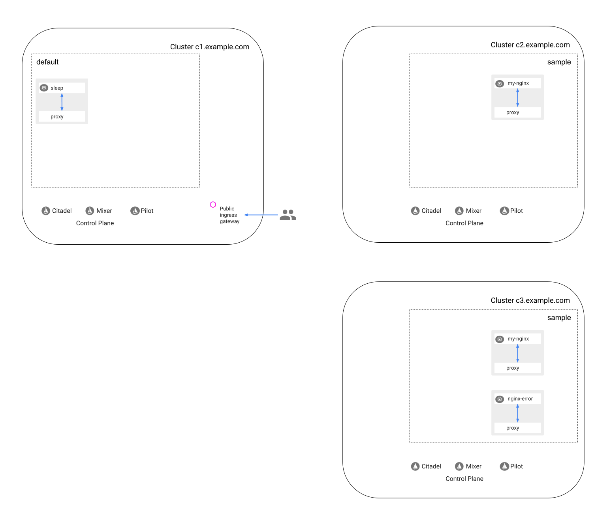
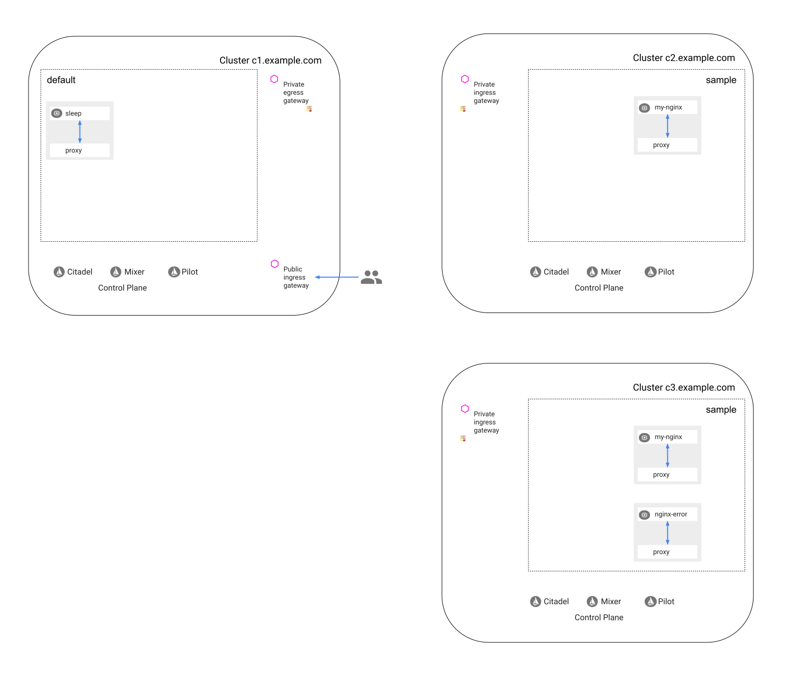
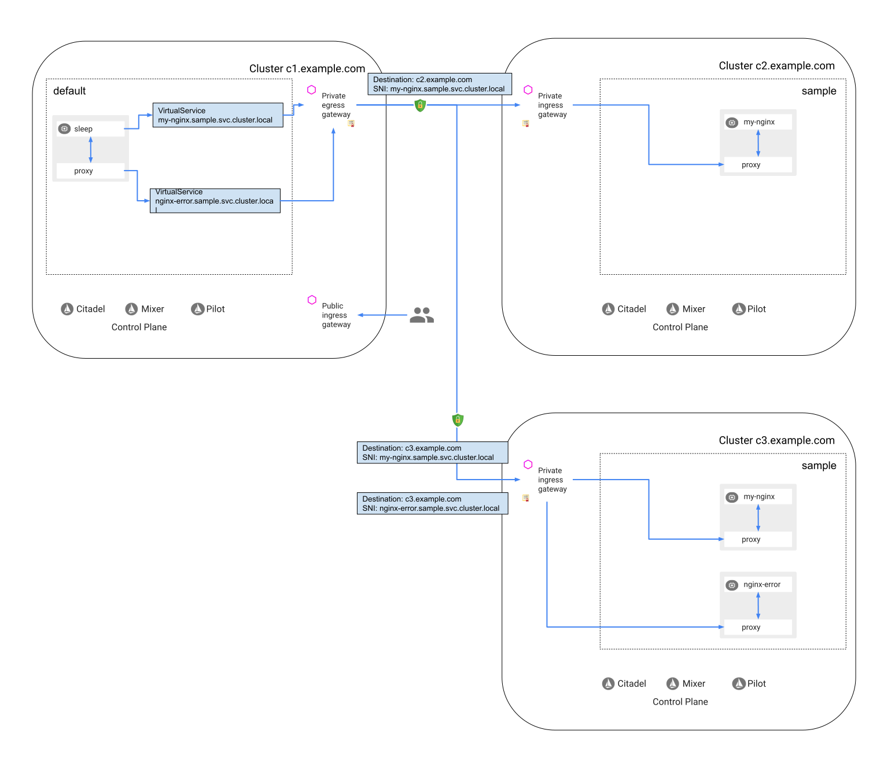
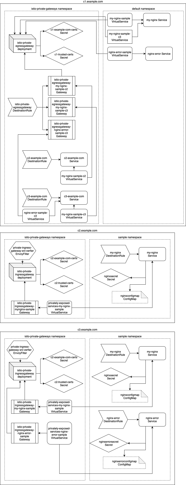

### Prerequisites for three clusters

See [Prerequisites for three clusters](../common-setup/#prerequisites-for-three-clusters)
in [common multi-mesh setup](../common-setup).

## Initial setup

In the following sections you deploy `my-nginx` service in the second cluster and the third cluster to demonstrate load
balancing between remote clusters, and also `nginx-error` service in the third cluster to demonstrate accessing
multiple service in a remote cluster. All the three services differ only by their root webpage.

Create the root certificate and private key for `Nginx` services:

```bash
openssl req -x509 -sha256 -nodes -days 365 -newkey rsa:2048 -subj '/O=example Inc./CN=nginx.example.com' -keyout nginx.example.com.key -out nginx.example.com.crt
```

### Deploy a TLS service in the second cluster

1.  Create a namespace for a TLS service in the second cluster and label it for Istio sidecar injection:

    ```bash
    kubectl create --context=$CTX_CLUSTER2 namespace sample
    kubectl label --context=$CTX_CLUSTER2 namespace sample istio-injection=enabled
    ```

    ```
    namespace/sample created
    namespace/sample labeled
    ```

1.  Create a certificates and a private key:

    ```bash
    openssl req -out nginx1.csr -newkey rsa:2048 -nodes -keyout nginx1.key -subj "/CN=my-nginx.sample.svc.cluster.local/O=my-nginx.sample.svc.cluster.local"
    openssl x509 -req -days 365 -CA nginx.example.com.crt -CAkey nginx.example.com.key -set_serial 0 -in nginx1.csr -out nginx1.crt
    ```

1.  Create secrets to contain the certificate and the private key:

    ```bash
    kubectl create secret tls nginxsecret --key ./nginx1.key --cert ./nginx1.crt -n sample --context=$CTX_CLUSTER2
    ```

    ```
    secret "nginxsecret" created
    ```

1.  Create a configuration map used for the HTTPS service:

    ```bash
    kubectl create configmap nginxconfigmap --from-file=samples/https/default.conf -n sample --context=$CTX_CLUSTER2
    ```

    ```
    configmap "nginxconfigmap" created
    ```

1.  Deploy an `Nginx` sample service:

    ```bash
    cat samples/https/nginx-app.yaml | sed 's/name: https/name: tls/g' | kubectl apply -n sample --context=$CTX_CLUSTER2 -f -
    ```

    ```
    service "my-nginx" created
    replicationcontroller "my-nginx" created
    ```

1.  Create a destination rule for `my-nginx`:

    ```bash
    kubectl apply --context=$CTX_CLUSTER2 -n sample -f - <<EOF
    apiVersion: networking.istio.io/v1alpha3
    kind: DestinationRule
    metadata:
      name: my-nginx
    spec:
      host: my-nginx
      trafficPolicy:
        tls:
          mode: ISTIO_MUTUAL
    EOF
    ```

### Setup the third cluster

1.  Create a namespace for TLS services in the third cluster and label it for Istio sidecar injection:

    ```bash
    kubectl create --context=$CTX_CLUSTER3 namespace sample
    kubectl label --context=$CTX_CLUSTER3 namespace sample istio-injection=enabled
    ```

    ```
    namespace/sample created
    namespace/sample labeled
    ```

1.  Create a certificates and a private key for two services in the third cluster:

    ```bash
    openssl req -out nginx2.csr -newkey rsa:2048 -nodes -keyout nginx2.key -subj "/CN=my-nginx.sample.svc.cluster.local/O=my-nginx.sample.svc.cluster.local"
    openssl x509 -req -days 365 -CA nginx.example.com.crt -CAkey nginx.example.com.key -set_serial 1 -in nginx2.csr -out nginx2.crt
    openssl req -out nginx-error.csr -newkey rsa:2048 -nodes -keyout nginx-error.key -subj "/CN=nginx-error.sample.svc.cluster.local/O=nginx-error.sample.svc.cluster.local"
    openssl x509 -req -days 365 -CA nginx.example.com.crt -CAkey nginx.example.com.key -set_serial 2 -in nginx-error.csr -out nginx-error.crt
    ```

1.  Create secrets to contain the certificates and the private keys:

    ```bash
    kubectl create secret tls nginxsecret --key ./nginx2.key --cert ./nginx2.crt -n sample --context=$CTX_CLUSTER3
    kubectl create secret tls nginxerrorsecret --key ./nginx-error.key --cert ./nginx-error.crt -n sample --context=$CTX_CLUSTER3
    ```

    ```
    secret "nginxsecret" created
    secret "nginxerrorsecret" created
    ```

1.  Create configurations for Nginx services that will return different web pages from the service in the second cluster,
    namely `index2.html` and `50x.html` (the service in the second cluster returns `index.html`). The choice of the web
    page has no meaning, you just use three different web pages of the default Nginx installation.

    ```bash
    cat samples/https/default.conf | sed 's/index.html/index2.html/g' > ./default2.conf
    cat samples/https/default.conf | sed 's/index.html/50x.html/g' > ./default-error.conf
    ```

1.  Create configuration maps used by the Nginx services:

    ```bash
    kubectl create configmap nginxconfigmap --from-file=./default2.conf -n sample --context=$CTX_CLUSTER3
    kubectl create configmap nginxerrorconfigmap --from-file=./default-error.conf -n sample --context=$CTX_CLUSTER3
    ```

    ```
    configmap "nginxconfigmap" created
    configmap "nginxerrorconfigmap" created
    ```

1.  Deploy the `my-nginx` service, while replacing `https` with `tls` in the port name. This is done for the sake
    of the example, to demonstrate federating TLS services, not only HTTPS.

    ```bash
    cat samples/https/nginx-app.yaml | sed 's/name: https/name: tls/g' | kubectl apply -n sample --context=$CTX_CLUSTER3 -f -
    ```

    ```
    service "my-nginx" created
    replicationcontroller "my-nginx" created
    ```

1.  Create a destination rule for `my-nginx`:

    ```bash
    kubectl apply --context=$CTX_CLUSTER3 -n sample -f - <<EOF
    apiVersion: networking.istio.io/v1alpha3
    kind: DestinationRule
    metadata:
      name: my-nginx
    spec:
      host: my-nginx
      trafficPolicy:
        tls:
          mode: ISTIO_MUTUAL
    EOF
    ```

1.  Deploy the `nginx-error` service:

    ```bash
    cat samples/https/nginx-app.yaml | sed 's/name: https/name: tls/g' | sed 's/name: my-nginx/name: nginx-error/g' | sed 's/secretName: nginxsecret/secretName: nginxerrorsecret/g' | sed 's/name: nginxconfigmap/name: nginxerrorconfigmap/g' | sed 's/app: nginx/app: nginx-error/g' | kubectl apply -n sample --context=$CTX_CLUSTER3 -f -
    ```

    ```
    service "nginx-error" created
    replicationcontroller "nginx-error" created
    ```

1.  Create a destination rule for `nginx-error`:

    ```bash
    kubectl apply --context=$CTX_CLUSTER3 -n sample -f - <<EOF
    apiVersion: networking.istio.io/v1alpha3
    kind: DestinationRule
    metadata:
      name: nginx-error
    spec:
      host: nginx-error
      trafficPolicy:
        tls:
          mode: ISTIO_MUTUAL
    EOF
    ```

### Deploy sleep samples in all the clusters and test that the services are accessed in each cluster, locally

1.  Create a secret for the `sleep` sample to contain the certificate of the server:

    ```bash
    kubectl create secret generic sleep-secret --from-file ./nginx.example.com.crt --context=$CTX_CLUSTER1
    kubectl create secret generic sleep-secret --from-file ./nginx.example.com.crt --context=$CTX_CLUSTER2
    kubectl create secret generic sleep-secret --from-file ./nginx.example.com.crt --context=$CTX_CLUSTER3
    ```

    ```
    secret/sleep-secret created
    secret/sleep-secret created
    secret/sleep-secret created
    ```

1.  In each of the clusters, deploy the [sleep](https://github.com/istio/istio/blob/master/samples/sleep) sample app to use as a test source
    for sending requests. (If you already have the sleep app deployed, no need to delete it)

    ```bash
    kubectl apply -f samples/sleep/sleep.yaml --context=$CTX_CLUSTER1
    kubectl apply -f samples/sleep/sleep.yaml --context=$CTX_CLUSTER2
    kubectl apply -f samples/sleep/sleep.yaml --context=$CTX_CLUSTER3
    ```

1.  Wait until the `sleep` apps are running and the previous versions, if any, are terminated:

    ```bash
    kubectl get pod -l app=sleep --context=$CTX_CLUSTER1
    kubectl get pod -l app=sleep --context=$CTX_CLUSTER2
    kubectl get pod -l app=sleep --context=$CTX_CLUSTER3
    ```

    ```
    NAME                     READY   STATUS    RESTARTS   AGE
    sleep-666475687f-f42ft   2/2     Running   0          4m8s
    NAME                     READY   STATUS    RESTARTS   AGE
    sleep-666475687f-hsnzx   2/2     Running   0          4m6s
    NAME                     READY   STATUS    RESTARTS   AGE
    sleep-666475687f-h6t7d   2/2     Running   0          4m6s
    ```

1.  Test accessing the `my-nginx.sample.svc.cluster.local` service in the second cluster locally:

    ```bash
    kubectl exec -it $(kubectl get pod -l app=sleep -o jsonpath='{.items..metadata.name}' --context=$CTX_CLUSTER2) -c sleep --context=$CTX_CLUSTER2 -- curl --cacert /etc/sleep/tls/nginx.example.com.crt https://my-nginx.sample.svc.cluster.local | grep -o "<title>.*</title>"
    ```

    ```
    <title>Welcome to nginx!</title>
    ```

1.  Test accessing the `my-nginx.sample.svc.cluster.local` service in the third cluster locally:

    ```bash
    kubectl exec -it $(kubectl get pod -l app=sleep -o jsonpath='{.items..metadata.name}' --context=$CTX_CLUSTER3) -c sleep --context=$CTX_CLUSTER3 -- curl --cacert /etc/sleep/tls/nginx.example.com.crt https://my-nginx.sample.svc.cluster.local | grep -o "<title>.*</title>"
    ```

    ```
    <title>Nginx reloaded!</title>
    ```

1.  Test accessing the `nginx-error.sample.svc.cluster.local` service in the third cluster locally:

    ```bash
    kubectl exec -it $(kubectl get pod -l app=sleep -o jsonpath='{.items..metadata.name}' --context=$CTX_CLUSTER3) -c sleep --context=$CTX_CLUSTER3 -- curl --cacert /etc/sleep/tls/nginx.example.com.crt https://nginx-error.sample.svc.cluster.local | grep -o "<title>.*</title>"
    ```

    ```
    <title>Error</title>
    ```

    Note that the error title is returned as expected, by the `nginx-error` service.

After completing the steps until now, you get the following setting (the `sleep` containers in the second and third
clusters omitted):


*The three clusters with the deployed services*

## Perform one-time setup of private gateways

Follow the instructions in the [Setup](../common-setup/#setup) section of [common multi-mesh setup](../common-setup).

Once you finish the instructions above, you get the following setting:


*The three clusters with the deployed services and gateways*

## Expose a TLS service in the second cluster

Expose the service in `sample`:

1.  Define an ingress `Gateway`:

    ```bash
    kubectl apply --context=$CTX_CLUSTER2 -n istio-private-gateways -f - <<EOF
    apiVersion: networking.istio.io/v1alpha3
    kind: Gateway
    metadata:
      name: istio-private-ingressgateway-my-nginx-sample
    spec:
      selector:
        istio: private-ingressgateway
      servers:
      - port:
          number: 15444
          name: tls
          protocol: TLS
        tls:
          mode: MUTUAL
          serverCertificate: /etc/istio/c2.example.com/certs/tls.crt
          privateKey: /etc/istio/c2.example.com/certs/tls.key
          caCertificates: /etc/istio/example.com/certs/example.com.crt
        hosts:
        - my-nginx.sample.svc.cluster.local
    EOF
    ```

1.  Configure routing to `my-nginx.sample.svc.cluster.local`:

    ```bash
    kubectl apply --context=$CTX_CLUSTER2 -n istio-private-gateways -f - <<EOF
    apiVersion: networking.istio.io/v1alpha3
    kind: VirtualService
    metadata:
      name: privately-exposed-services-my-nginx-sample
    spec:
      hosts:
      - my-nginx.sample.svc.cluster.local
      gateways:
      - istio-private-ingressgateway-my-nginx-sample
      tcp:
      - match:
        - port: 15444
        route:
        - destination:
            host: my-nginx.sample.svc.cluster.local
            port:
              number: 443
    EOF
    ```

1.  Add a filter to verify that the SNI of the mutual TLS connection (the SNI reported to Mixer) is
    identical to the original SNI issued by the application:

    ```bash
    kubectl apply --context=$CTX_CLUSTER2 -n istio-private-gateways -f - <<EOF
    # The following filter verifies that the SNI of the mutual TLS connection (the SNI reported to Mixer) is
    # identical to the original SNI issued by the client (the SNI used for routing by the SNI proxy).
    # The filter prevents Mixer from being deceived by a malicious client: routing to one SNI while
    # reporting some other value of SNI. If the original SNI does not match the SNI of the mutual TLS connection, the
    # filter will block the connection to the external service.
    apiVersion: networking.istio.io/v1alpha3
    kind: EnvoyFilter
    metadata:
      name: private-ingress-gateway-sni-verifier
    spec:
      workloadSelector:
        labels:
          app: istio-private-ingressgateway
      configPatches:
      - applyTo: NETWORK_FILTER
        match:
          context: GATEWAY
          listener:
            portNumber: 15444
            filterChain:
              filter:
                name: mixer
        patch:
          operation: INSERT_BEFORE
          value:
             name: sni_verifier
             config: {}
    EOF
    ```

## Consume the exposed TLS service in the first cluster

Bind the service exposed from `cluster2` to the same name in `cluster1`.

1.  Create a Kubernetes service for `c2.example.com` since it is not an existing hostname. In the real life, you
    would use the real hostname of your cluster.

    :warning:
    Here an ExternalName service is used since Istio can handle subsets for external services only for ExternalName
    services, not for Services with Endpoints.

    ```bash
    kubectl apply --context=$CTX_CLUSTER1 -n istio-private-gateways -f - <<EOF
    kind: Service
    apiVersion: v1
    metadata:
      name: c2-example-com
    spec:
      type: ExternalName
      externalName: $CLUSTER2_INGRESS_HOST
      ports:
      - name: tls-for-cross-cluster-communication
        protocol: TCP
        port: 15444
    EOF
    ```

1.  Create an egress `Gateway` for `my-nginx-c2.sample.svc.cluster.local`, port 15444, a destination rule for
    traffic directed to the egress gateway and for traffic from the egress gateway to the second cluster:

    ```bash
    kubectl apply --context=$CTX_CLUSTER1 -n istio-private-gateways -f - <<EOF
    apiVersion: networking.istio.io/v1alpha3
    kind: Gateway
    metadata:
      name: istio-private-egressgateway-my-nginx-sample-c2
    spec:
      selector:
        istio: private-egressgateway
      servers:
      - port:
          number: 15444
          name: tls
          protocol: TLS
        hosts:
        - my-nginx-c2.sample.svc.cluster.local
        tls:
          mode: MUTUAL
          serverCertificate: /etc/certs/cert-chain.pem
          privateKey: /etc/certs/key.pem
          caCertificates: /etc/certs/root-cert.pem
    ---
    apiVersion: networking.istio.io/v1alpha3
    kind: DestinationRule
    metadata:
      name: istio-private-egressgateway
    spec:
      host: istio-private-egressgateway.istio-private-gateways.svc.cluster.local
      subsets:
      - name: my-nginx-sample-c2
        trafficPolicy:
          loadBalancer:
            simple: ROUND_ROBIN
          portLevelSettings:
          - port:
              number: 15444
            tls:
              mode: ISTIO_MUTUAL
              sni: my-nginx-c2.sample.svc.cluster.local
    ---
    apiVersion: networking.istio.io/v1alpha3
    kind: DestinationRule
    metadata:
      name: c2-example-com
    spec:
      host: c2-example-com.istio-private-gateways.svc.cluster.local
      exportTo:
      - "."
      subsets:
      - name: my-nginx-sample
        trafficPolicy:
          loadBalancer:
            simple: ROUND_ROBIN
          portLevelSettings:
          - port:
              number: 15444
            tls:
              mode: MUTUAL
              clientCertificate: /etc/istio/c1.example.com/certs/tls.crt
              privateKey: /etc/istio/c1.example.com/certs/tls.key
              caCertificates: /etc/istio/example.com/certs/example.com.crt
              sni: my-nginx.sample.svc.cluster.local
    EOF
    ```

1.  Define a virtual service to direct traffic from the egress gateway to the external service:

    ```bash
    kubectl apply --context=$CTX_CLUSTER1 -n istio-private-gateways -f - <<EOF
    apiVersion: networking.istio.io/v1alpha3
    kind: VirtualService
    metadata:
      name: my-nginx-sample-c2
    spec:
      hosts:
      - my-nginx-c2.sample.svc.cluster.local
      gateways:
      - istio-private-egressgateway-my-nginx-sample-c2
      tcp:
      - match:
          - port: 15444
        route:
        - destination:
            host: c2-example-com.istio-private-gateways.svc.cluster.local
            subset: my-nginx-sample
            port:
              number: 15444
          weight: 100
    EOF
    ```

1.  To handle DNS of the remote service, create the `sample` namespace in the first cluster.
    You have to do it since the name of the called service for TLS must match the name of the remote service
    (the client code may check that the called name matches the name returned by the server).
    The following command creates the namespace if it not exists yet:

    ```bash
    kubectl apply --context=$CTX_CLUSTER1 -f - <<EOF
    apiVersion: v1
    kind: Namespace
    metadata:
      name: sample
    EOF
    ```

1.  Create a selector-less service `my-nginx` in `sample`:

    ```bash
    kubectl apply --context=$CTX_CLUSTER1 -n sample -f - <<EOF
    kind: Service
    apiVersion: v1
    metadata:
      name: my-nginx
    spec:
      type: ClusterIP
      ports:
      - name: tls
        protocol: TCP
        port: 443
    EOF
    ```

1.  Define a virtual service to direct the traffic from sidecars to the egress gateway for the `my-nginx.sample`
    service:

    ```bash
    kubectl apply --context=$CTX_CLUSTER1 -n sample -f - <<EOF
    apiVersion: networking.istio.io/v1alpha3
    kind: VirtualService
    metadata:
      name: my-nginx-sample
    spec:
      hosts:
      - my-nginx.sample.svc.cluster.local
      tls:
      - match:
        - port: 443
          sni_hosts:
          - my-nginx.sample.svc.cluster.local
        route:
        - destination:
            host: istio-private-egressgateway.istio-private-gateways.svc.cluster.local
            subset: my-nginx-sample-c2
            port:
              number: 15444
    EOF
    ```

1.  Test accessing the `my-nginx.sample.svc.cluster.local` service from the first cluster:

    ```bash
    kubectl exec -it $(kubectl get pod -l app=sleep -o jsonpath='{.items..metadata.name}' --context=$CTX_CLUSTER1) -c sleep --context=$CTX_CLUSTER1 -- curl --cacert /etc/sleep/tls/nginx.example.com.crt https://my-nginx.sample.svc.cluster.local | grep -o "<title>.*</title>"
    ```

    ```
    <title>Welcome to nginx!</title>
    ```

## Expose two TLS services in the third cluster

1.  Define an ingress `Gateway` for `my-nginx.sample`:

    ```bash
    kubectl apply --context=$CTX_CLUSTER3 -n istio-private-gateways -f - <<EOF
    apiVersion: networking.istio.io/v1alpha3
    kind: Gateway
    metadata:
      name: istio-private-ingressgateway-my-nginx-sample
    spec:
      selector:
        istio: private-ingressgateway
      servers:
      - port:
          number: 15444
          name: tls
          protocol: TLS
        tls:
          mode: MUTUAL
          serverCertificate: /etc/istio/c3.example.com/certs/tls.crt
          privateKey: /etc/istio/c3.example.com/certs/tls.key
          caCertificates: /etc/istio/example.com/certs/example.com.crt
        hosts:
        - my-nginx.sample.svc.cluster.local
    EOF
    ```

1.  Configure routing to `my-nginx.sample.svc.cluster.local`:

    ```bash
    kubectl apply --context=$CTX_CLUSTER3 -n istio-private-gateways -f - <<EOF
    apiVersion: networking.istio.io/v1alpha3
    kind: VirtualService
    metadata:
      name: privately-exposed-services-my-nginx-sample
    spec:
      hosts:
      - my-nginx.sample.svc.cluster.local
      gateways:
      - istio-private-ingressgateway-my-nginx-sample
      tcp:
      - match:
        - port: 15444
        route:
        - destination:
            host: my-nginx.sample.svc.cluster.local
            port:
              number: 443
    EOF
    ```

1.  Define an ingress `Gateway` for `nginx-error.sample`:

    ```bash
    kubectl apply --context=$CTX_CLUSTER3 -n istio-private-gateways -f - <<EOF
    apiVersion: networking.istio.io/v1alpha3
    kind: Gateway
    metadata:
      name: istio-private-ingressgateway-nginx-error-sample
    spec:
      selector:
        istio: private-ingressgateway
      servers:
      - port:
          number: 15444
          name: tls
          protocol: TLS
        tls:
          mode: MUTUAL
          serverCertificate: /etc/istio/c3.example.com/certs/tls.crt
          privateKey: /etc/istio/c3.example.com/certs/tls.key
          caCertificates: /etc/istio/example.com/certs/example.com.crt
        hosts:
        - nginx-error.sample.svc.cluster.local
    EOF
    ```

1.  Configure routing to `nginx-error.sample.svc.cluster.local`:

    ```bash
    kubectl apply --context=$CTX_CLUSTER3 -n istio-private-gateways -f - <<EOF
    apiVersion: networking.istio.io/v1alpha3
    kind: VirtualService
    metadata:
      name: privately-exposed-services-nginx-error-sample
    spec:
      hosts:
      - nginx-error.sample.svc.cluster.local
      gateways:
      - istio-private-ingressgateway-nginx-error-sample
      tcp:
      - match:
        - port: 15444
        route:
        - destination:
            host: nginx-error.sample.svc.cluster.local
            port:
              number: 443
    EOF
    ```

1.  Add a filter to verify that the SNI of the mutual TLS connection (the SNI reported to Mixer) is
    identical to the original SNI issued by the application:

    ```bash
    kubectl apply --context=$CTX_CLUSTER3 -n istio-private-gateways -f - <<EOF
    # The following filter verifies that the SNI of the mutual TLS connection (the SNI reported to Mixer) is
    # identical to the original SNI issued by the client (the SNI used for routing by the SNI proxy).
    # The filter prevents Mixer from being deceived by a malicious client: routing to one SNI while
    # reporting some other value of SNI. If the original SNI does not match the SNI of the mutual TLS connection, the
    # filter will block the connection to the external service.
    apiVersion: networking.istio.io/v1alpha3
    kind: EnvoyFilter
    metadata:
      name: private-ingress-gateway-sni-verifier
    spec:
      workloadSelector:
        labels:
          app: istio-private-ingressgateway
      configPatches:
      - applyTo: NETWORK_FILTER
        match:
          context: GATEWAY
          listener:
            portNumber: 15444
            filterChain:
              filter:
                name: mixer
        patch:
          operation: INSERT_BEFORE
          value:
             name: sni_verifier
             config: {}
    EOF
    ```

## Consume the both exposed TLS services in the first cluster

Bind the services exposed from `cluster3` to the same name in `cluster1`.

1.  Create a Kubernetes service for `c3.example.com` since it is not an existing hostname. In the real life, you
    would use the real hostname of your cluster.

    :warning:
    Here an ExternalName service is used since Istio can handle subsets for external services only for ExternalName
    services, not for Services with Endpoints.


    ```bash
    kubectl apply --context=$CTX_CLUSTER1 -n istio-private-gateways -f - <<EOF
    kind: Service
    apiVersion: v1
    metadata:
      name: c3-example-com
    spec:
      type: ExternalName
      externalName: $CLUSTER3_INGRESS_HOST
      ports:
      - name: tls-for-cross-cluster-communication
        protocol: TCP
        port: 15444
    EOF
    ```

1.  Create an egress gateways for `my-nginx.sample.svc.cluster.local` and for `nginx-error.sample.svc.cluster.local`,
    port 15444, redefine the destination rule for traffic directed to the egress gateway and create a new destination
    rule for traffic from the egress gateway to the third cluster:

    ```bash
    kubectl apply --context=$CTX_CLUSTER1 -n istio-private-gateways -f - <<EOF
    apiVersion: networking.istio.io/v1alpha3
    kind: Gateway
    metadata:
      name: istio-private-egressgateway-my-nginx-sample-c3
    spec:
      selector:
        istio: private-egressgateway
      servers:
      - port:
          number: 15444
          name: tls
          protocol: TLS
        hosts:
        - my-nginx-c3.sample.svc.cluster.local
        tls:
          mode: MUTUAL
          serverCertificate: /etc/certs/cert-chain.pem
          privateKey: /etc/certs/key.pem
          caCertificates: /etc/certs/root-cert.pem
    ---
    apiVersion: networking.istio.io/v1alpha3
    kind: Gateway
    metadata:
      name: istio-private-egressgateway-nginx-error-sample-c3
    spec:
      selector:
        istio: private-egressgateway
      servers:
      - port:
          number: 15444
          name: tls
          protocol: TLS
        hosts:
        - nginx-error-c3.sample.svc.cluster.local
        tls:
          mode: MUTUAL
          serverCertificate: /etc/certs/cert-chain.pem
          privateKey: /etc/certs/key.pem
          caCertificates: /etc/certs/root-cert.pem
    ---
    apiVersion: networking.istio.io/v1alpha3
    kind: DestinationRule
    metadata:
      name: istio-private-egressgateway
    spec:
      host: istio-private-egressgateway.istio-private-gateways.svc.cluster.local
      subsets:
      - name: my-nginx-sample-c2
        trafficPolicy:
          loadBalancer:
            simple: ROUND_ROBIN
          portLevelSettings:
          - port:
              number: 15444
            tls:
              mode: ISTIO_MUTUAL
              sni: my-nginx-c2.sample.svc.cluster.local
      - name: my-nginx-sample-c3
        trafficPolicy:
          loadBalancer:
            simple: ROUND_ROBIN
          portLevelSettings:
          - port:
              number: 15444
            tls:
              mode: ISTIO_MUTUAL
              sni: my-nginx-c3.sample.svc.cluster.local
      - name: nginx-error-sample-c3
        trafficPolicy:
          loadBalancer:
            simple: ROUND_ROBIN
          portLevelSettings:
          - port:
              number: 15444
            tls:
              mode: ISTIO_MUTUAL
              sni: nginx-error-c3.sample.svc.cluster.local
    ---
    apiVersion: networking.istio.io/v1alpha3
    kind: DestinationRule
    metadata:
      name: c3-example-com
    spec:
      host: c3-example-com.istio-private-gateways.svc.cluster.local
      exportTo:
      - "."
      subsets:
      - name: my-nginx-sample
        trafficPolicy:
          loadBalancer:
            simple: ROUND_ROBIN
          portLevelSettings:
          - port:
              number: 15444
            tls:
              mode: MUTUAL
              clientCertificate: /etc/istio/c1.example.com/certs/tls.crt
              privateKey: /etc/istio/c1.example.com/certs/tls.key
              caCertificates: /etc/istio/example.com/certs/example.com.crt
              sni: my-nginx.sample.svc.cluster.local
      - name: nginx-error-sample
        trafficPolicy:
          loadBalancer:
            simple: ROUND_ROBIN
          portLevelSettings:
          - port:
              number: 15444
            tls:
              mode: MUTUAL
              clientCertificate: /etc/istio/c1.example.com/certs/tls.crt
              privateKey: /etc/istio/c1.example.com/certs/tls.key
              caCertificates: /etc/istio/example.com/certs/example.com.crt
              sni: nginx-error.sample.svc.cluster.local
    EOF
    ```

1.  Define virtual services to direct traffic from the egress gateway to the external services:

    ```bash
    kubectl apply --context=$CTX_CLUSTER1 -n istio-private-gateways -f - <<EOF
    apiVersion: networking.istio.io/v1alpha3
    kind: VirtualService
    metadata:
      name: my-nginx-sample-c3
    spec:
      hosts:
      - my-nginx-c3.sample.svc.cluster.local
      gateways:
      - istio-private-egressgateway-my-nginx-sample-c3
      tcp:
      - match:
          - port: 15444
        route:
        - destination:
            host: c3-example-com.istio-private-gateways.svc.cluster.local
            subset: my-nginx-sample
            port:
              number: 15444
          weight: 100
    ---
    apiVersion: networking.istio.io/v1alpha3
    kind: VirtualService
    metadata:
      name: nginx-error-sample-c3
    spec:
      hosts:
      - nginx-error-c3.sample.svc.cluster.local
      gateways:
      - istio-private-egressgateway-nginx-error-sample-c3
      tcp:
      - match:
          - port: 15444
        route:
        - destination:
            host: c3-example-com.istio-private-gateways.svc.cluster.local
            subset: nginx-error-sample
            port:
              number: 15444
          weight: 100
    EOF
    ```

1.  Create a selector-less service for `nginx-error` in `sample` to handle DNS:

    ```bash
    kubectl apply --context=$CTX_CLUSTER1 -n sample -f - <<EOF
    kind: Service
    apiVersion: v1
    metadata:
      name: nginx-error
    spec:
      type: ClusterIP
      ports:
      - name: tls
        protocol: TCP
        port: 443
    EOF
    ```

1.  Define a virtual service to direct the traffic from sidecars to the egress gateway for the `nginx-error` service:

    ```bash
    kubectl apply --context=$CTX_CLUSTER1 -n sample -f - <<EOF
    apiVersion: networking.istio.io/v1alpha3
    kind: VirtualService
    metadata:
      name: nginx-error-sample
    spec:
      hosts:
      - nginx-error.sample.svc.cluster.local
      tls:
      - match:
        - port: 443
          sni_hosts:
          - nginx-error.sample.svc.cluster.local
        route:
        - destination:
            host: istio-private-egressgateway.istio-private-gateways.svc.cluster.local
            subset: nginx-error-sample-c3
            port:
              number: 15444
    EOF
    ```

1.  Test accessing the `nginx-error.sample.svc.cluster.local` service from the first cluster:

    ```bash
    kubectl exec -it $(kubectl get pod -l app=sleep -o jsonpath='{.items..metadata.name}' --context=$CTX_CLUSTER1) -c sleep --context=$CTX_CLUSTER1 -- curl --cacert /etc/sleep/tls/nginx.example.com.crt https://nginx-error.sample.svc.cluster.local | grep -o "<title>.*</title>"
    ```

    ```
    <title>Error</title>
    ```

1.  Redefine a virtual service to direct the traffic from sidecars to the egress gateway for the `my-nginx.sample`
    service, to split the traffic 50:50 between the second and the third cluster:

    ```bash
    kubectl apply --context=$CTX_CLUSTER1 -n sample -f - <<EOF
    apiVersion: networking.istio.io/v1alpha3
    kind: VirtualService
    metadata:
      name: my-nginx-sample
    spec:
      hosts:
      - my-nginx.sample.svc.cluster.local
      tls:
      - match:
        - port: 443
          sni_hosts:
          - my-nginx.sample.svc.cluster.local
        route:
        - destination:
            host: istio-private-egressgateway.istio-private-gateways.svc.cluster.local
            subset: my-nginx-sample-c2
            port:
              number: 15444
          weight: 50
        - destination:
            host: istio-private-egressgateway.istio-private-gateways.svc.cluster.local
            subset: my-nginx-sample-c3
            port:
              number: 15444
          weight: 50
    EOF
    ```

1.  Send ten requests to ``my-nginx.sample.svc.cluster.local` service from the first cluster:

    ```bash
    kubectl exec -it $(kubectl get pod -l app=sleep -o jsonpath='{.items..metadata.name}' --context=$CTX_CLUSTER1) -c sleep --context=$CTX_CLUSTER1 -- sh -c 'for i in `seq 1 10`; do curl -s --cacert /etc/sleep/tls/nginx.example.com.crt https://my-nginx.sample.svc.cluster.local | grep -o "<title>.*</title>"; done'
    ```

    ```
    <title>Welcome to nginx!</title>
    <title>Nginx reloaded!</title>
    <title>Welcome to nginx!</title>
    <title>Nginx reloaded!</title>
    <title>Nginx reloaded!</title>
    <title>Nginx reloaded!</title>
    <title>Welcome to nginx!</title>
    <title>Nginx reloaded!</title>
    <title>Welcome to nginx!</title>
    <title>Welcome to nginx!</title>
    ```

You have now the setting as shown in the diagram below:


*The three clusters with configured exposure and consumption*

The involved configuration items:



## Apply Istio RBAC on the third cluster

In this section you harden the security of your third cluster by applying
[Istio RBAC](/docs/concepts/security/#authorization) on the `sample` namespace and on the namespace of the private
ingress gateway. The goal is to control which service is allowed to call which specific service, which services are
allowed to be accessed from the outside through the private ingress gateway and which external clusters are allowed to
access which specific services. The goal is to reduce the possible attack vector in case some of the internal services
or the external clusters is compromised.

Access control is enforced at the entrance to the cluster and also inside the cluster, following the
[Defense-in-depth principle](https://en.wikipedia.org/wiki/Defense_in_depth_(computing)) and implementing
[boundary protection](https://insights.sei.cmu.edu/insider-threat/2018/09/cybersecurity-architecture-part-2-system-boundary-and-boundary-protection.html).

The security is hardened in two phases in the next subsections:

1. You enable Istio RBAC on the `sample` namespace, and declare
that only `my-nginx` and `nginx-error` are allowed to be accessed from the outside through the private ingress gateway.
You also allow `nginx-error` to be called by the `sleep` sample.

1. You enable Istio RBAC on the `istio-private-gateways` namespace and declare that only cluster `c1` is allowed to
access `my-nginx` and only cluster `c4` is allowed to access `nginx-error` through the private ingress gateway.

Istio will deny all the unspecified access.

### Apply Istio RBAC on the `sample` namespace

1.  Create Istio service roles for read access to `helloworld` and `httpbin`.

    ```bash
    kubectl apply  --context=$CTX_CLUSTER3 -n sample -f - <<EOF
    apiVersion: rbac.istio.io/v1alpha1
    kind: ServiceRole
    metadata:
      name: my-nginx-accessor
    spec:
      rules:
      - services: ["my-nginx.sample.svc.cluster.local"]
        constraints:
        - key: "destination.port"
          values: ["443"]
    ---
    apiVersion: rbac.istio.io/v1alpha1
    kind: ServiceRole
    metadata:
      name: nginx-error-accessor
    spec:
      rules:
      - services: ["nginx-error.sample.svc.cluster.local"]
        constraints:
        - key: "destination.port"
          values: ["443"]
    EOF
    ```

1.  Create role bindings to enable read access to the services according to the requirements of the application.
    `my-nginx` may be called from the private ingress gateway, `nginx-error` can also be called from the private ingress
    gateway and also from `sleep`. These role bindings forbid, for example, calls from `my-nginx` to `nginx-error`.

    ```bash
    kubectl apply --context=$CTX_CLUSTER3 -n sample -f - <<EOF
    apiVersion: rbac.istio.io/v1alpha1
    kind: ServiceRoleBinding
    metadata:
      name: my-nginx-accessor
    spec:
      subjects:
      - user: "cluster.local/ns/istio-private-gateways/sa/istio-private-ingressgateway-service-account"
      roleRef:
        kind: ServiceRole
        name: my-nginx-accessor
    ---
    apiVersion: rbac.istio.io/v1alpha1
    kind: ServiceRoleBinding
    metadata:
      name: nginx-error-accessor
    spec:
      subjects:
      - user: "cluster.local/ns/default/sa/sleep"
      - user: "cluster.local/ns/istio-private-gateways/sa/istio-private-ingressgateway-service-account"
      roleRef:
        kind: ServiceRole
        name: nginx-error-accessor
    EOF
    ```

1.  Enable [Istio RBAC](/docs/concepts/security/#authorization) on the `sample` namespace.

    :warning:
    If you already enabled Istio RBAC on some of your namespaces, add `sample` to the list of the included namespaces.
    The command below assumes that `sample` is the only namespace you enabled RBAC on.


    ```bash
    kubectl apply --context=$CTX_CLUSTER3 -f - <<EOF
    apiVersion: "rbac.istio.io/v1alpha1"
    kind: ClusterRbacConfig
    metadata:
      name: default
      namespace: istio-system
    spec:
      mode: ON_WITH_INCLUSION
      inclusion:
        namespaces: [ sample ]
    EOF
    ```

1.  Check that unauthorized access is denied. Send a request from `sleep` to `my-nginx`:

    ```bash
    kubectl exec -it $(kubectl get pod -l app=sleep -o jsonpath='{.items..metadata.name}' --context=$CTX_CLUSTER3) -c sleep --context=$CTX_CLUSTER3 -- curl --cacert /etc/sleep/tls/nginx.example.com.crt https://my-nginx.sample.svc.cluster.local
    curl: (35) OpenSSL SSL_connect: SSL_ERROR_SYSCALL in connection to my-nginx.sample.svc.cluster.local:443
    command terminated with exit code 35
    ```

1.  Check that `sleep` can call `nginx-error`, since it is allowed by the policy:

    ```bash
    kubectl exec -it $(kubectl get pod -l app=sleep -o jsonpath='{.items..metadata.name}' --context=$CTX_CLUSTER3) -c sleep --context=$CTX_CLUSTER3 -- curl --cacert /etc/sleep/tls/nginx.example.com.crt https://nginx-error.sample.svc.cluster.local | grep -o "<title>.*</title>"
    ```

    ```
    <title>Error</title>
    ```

1.  Check the services can be called from the first cluster as previously. Test accessing the
    `nginx-error.sample.svc.cluster.local` service from the first cluster:

    ```bash
    kubectl exec -it $(kubectl get pod -l app=sleep -o jsonpath='{.items..metadata.name}' --context=$CTX_CLUSTER1) -c sleep --context=$CTX_CLUSTER1 -- curl --cacert /etc/sleep/tls/nginx.example.com.crt https://nginx-error.sample.svc.cluster.local | grep -o "<title>.*</title>"
    ```

    ```
    <title>Error</title>
    ```

1.  Send ten requests to `my-nginx.sample.svc.cluster.local` service from the first cluster:

    ```bash
    kubectl exec -it $(kubectl get pod -l app=sleep -o jsonpath='{.items..metadata.name}' --context=$CTX_CLUSTER1) -c sleep --context=$CTX_CLUSTER1 -- sh -c 'for i in `seq 1 10`; do curl -s --cacert /etc/sleep/tls/nginx.example.com.crt https://my-nginx.sample.svc.cluster.local | grep -o "<title>.*</title>"; done'
    ```

    ```
    <title>Welcome to nginx!</title>
    <title>Nginx reloaded!</title>
    <title>Welcome to nginx!</title>
    <title>Nginx reloaded!</title>
    <title>Nginx reloaded!</title>
    <title>Nginx reloaded!</title>
    <title>Welcome to nginx!</title>
    <title>Nginx reloaded!</title>
    <title>Welcome to nginx!</title>
    <title>Welcome to nginx!</title>
    ```

### Enable RBAC on the ingress gateway

1.  Currently, the only identities Istio RBAC can handle are the identities of Istio mutual TLS. In this case, you want
    to control the traffic for non-Istio mutual TLS from external clusters. To do that, you can use Envoy's filter [`envoy.filters.http.rbac`](https://www.envoyproxy.io/docs/envoy/latest/configuration/http_filters/rbac_filter).
    To instruct Istio to use that filter, create an
    [`EnvoyFilter`](/docs/reference/config/networking/v1alpha3/envoy-filter/).

    Specify the RBAC policy that allows only the `c1` cluster to access `my-nginx.sample.svc.cluster.local` on port
    15444 of the istio-ingress gateway:

    ```bash
    kubectl apply  --context=$CTX_CLUSTER3 -n istio-private-gateways -f - <<EOF
    apiVersion: networking.istio.io/v1alpha3
    kind: EnvoyFilter
    metadata:
      name: private-ingress-rbac
    spec:
      workloadSelector:
        labels:
          app: istio-private-ingressgateway
      configPatches:
      - applyTo: NETWORK_FILTER
        match:
          context: GATEWAY
          listener:
            portNumber: 15444
            filterChain:
              filter:
                name: mixer
              sni: my-nginx.sample.svc.cluster.local
        patch:
          operation: INSERT_BEFORE
          value:
             name: envoy.filters.network.rbac
             config:
               rules:
                 policies:
                   ingress-accessor:
                     permissions:
                     - and_rules:
                         rules:
                         - or_rules:
                             rules:
                             - destination_port: 15444
                     principals:
                     - and_ids:
                         ids:
                         - authenticated:
                             principal_name:
                               exact: spiffe://c1.example.com/istio-private-egressgateway
               stat_prefix: "tcp."
      - applyTo: NETWORK_FILTER
        match:
          context: GATEWAY
          listener:
            portNumber: 15444
            filterChain:
              filter:
                name: mixer
              sni: nginx-error.sample.svc.cluster.local
        patch:
          operation: INSERT_BEFORE
          value:
             name: envoy.filters.network.rbac
             config:
               rules:
                 policies:
                   ingress-accessor:
                     permissions:
                     - and_rules:
                         rules:
                         - or_rules:
                             rules:
                             - destination_port: 15444
                     principals:
                     - and_ids:
                         ids:
                         - authenticated:
                             principal_name:
                               exact: spiffe://c4.example.com/istio-private-egressgateway
               stat_prefix: "tcp."
    EOF
    ```

1.  Send ten requests to `my-nginx.sample.svc.cluster.local` service from the first cluster, as previously, and observe
    that the service is accessible to the first cluster.

    ```bash
    kubectl exec -it $(kubectl get pod -l app=sleep -o jsonpath='{.items..metadata.name}' --context=$CTX_CLUSTER1) -c sleep --context=$CTX_CLUSTER1 -- sh -c 'for i in `seq 1 10`; do curl -s --cacert /etc/sleep/tls/nginx.example.com.crt https://my-nginx.sample.svc.cluster.local | grep -o "<title>.*</title>"; done'
    ```

    ```
    <title>Welcome to nginx!</title>
    <title>Nginx reloaded!</title>
    <title>Welcome to nginx!</title>
    <title>Nginx reloaded!</title>
    <title>Nginx reloaded!</title>
    <title>Nginx reloaded!</title>
    <title>Welcome to nginx!</title>
    <title>Nginx reloaded!</title>
    <title>Welcome to nginx!</title>
    <title>Welcome to nginx!</title>
    ```

1.  Check that the `nginx-error.sample.svc.cluster.local` service is blocked for access from the first cluster:

    ```bash
    kubectl exec -it $(kubectl get pod -l app=sleep -o jsonpath='{.items..metadata.name}' --context=$CTX_CLUSTER1) -c sleep --context=$CTX_CLUSTER1 -- curl --cacert /etc/sleep/tls/nginx.example.com.crt https://nginx-error.sample.svc.cluster.local | grep -o "<title>.*</title>"
    ```

    ```
    command terminated with exit code 35
    ```

## Cleanup

### Disable Istio RBAC in the third cluster

1.  Disable [Istio RBAC](/docs/concepts/security/#authorization) on the `sample` and `istio-private-gateways`
    namespaces.

    :warning:
    If you enabled Istio RBAC on some of your namespaces, remove `sample`
    from the list of the included namespaces. The command below assumes that you enabled Istio RBAC only on the
    `sample` namespace.


    ```bash
    kubectl delete --context=$CTX_CLUSTER3 -n istio-system clusterrbacconfig default
    ```

1.  Delete the service roles and service role bindings:

    ```bash
    kubectl delete --context=$CTX_CLUSTER3 -n sample servicerolebinding my-nginx-accessor nginx-error-accessor
    kubectl delete --context=$CTX_CLUSTER3 -n sample servicerole my-nginx-accessor nginx-error-accessor
    ```

1.  Delete the Envoy's filter:

    ```bash
    kubectl delete envoyfilter private-ingress-rbac -n istio-private-gateways --context=$CTX_CLUSTER3
    ```

### Remove the exposure of the services in the second cluster:

```bash
kubectl delete envoyfilter private-ingress-gateway-sni-verifier -n istio-private-gateways --context=$CTX_CLUSTER2
kubectl delete virtualservice privately-exposed-services-my-nginx-sample -n istio-private-gateways --context=$CTX_CLUSTER2
kubectl delete gateway istio-private-ingressgateway-my-nginx-sample -n istio-private-gateways --context=$CTX_CLUSTER2
```

### Remove the exposure of the services in the third cluster:

```bash
kubectl delete envoyfilter private-ingress-gateway-sni-verifier -n istio-private-gateways --context=$CTX_CLUSTER3
kubectl delete virtualservice privately-exposed-services-my-nginx-sample privately-exposed-services-nginx-error-sample -n istio-private-gateways --context=$CTX_CLUSTER3
kubectl delete gateway istio-private-ingressgateway-my-nginx-sample istio-private-ingressgateway-nginx-error-sample -n istio-private-gateways --context=$CTX_CLUSTER3
```

### Remove the consumption of the services in the first cluster:

```bash
kubectl delete virtualservice my-nginx-sample-c2 my-nginx-sample-c3 nginx-error-sample-c3 -n istio-private-gateways --context=$CTX_CLUSTER1
kubectl delete gateway istio-private-egressgateway-my-nginx-sample-c2 istio-private-egressgateway-my-nginx-sample-c3 istio-private-egressgateway-nginx-error-sample-c3 -n istio-private-gateways --context=$CTX_CLUSTER1
kubectl delete service c2-example-com c3-example-com -n istio-private-gateways --context=$CTX_CLUSTER1
kubectl delete virtualservice my-nginx-sample nginx-error-sample -n sample --context=$CTX_CLUSTER1
kubectl delete service my-nginx nginx-error -n sample --context=$CTX_CLUSTER1
kubectl delete destinationrule istio-private-egressgateway c2-example-com c3-example-com -n istio-private-gateways --context=$CTX_CLUSTER1
```

### Delete the sleep apps:

1.  Delete the sleep secrets

    ```bash
    kubectl delete secret sleep-secret --context=$CTX_CLUSTER1
    kubectl delete secret sleep-secret --context=$CTX_CLUSTER2
    kubectl delete secret sleep-secret --context=$CTX_CLUSTER3
    ```

1.  Undeploy the services:

    ```bash
    kubectl delete -f samples/sleep/sleep.yaml --context=$CTX_CLUSTER1
    kubectl delete -f samples/sleep/sleep.yaml --context=$CTX_CLUSTER2
    kubectl delete -f samples/sleep/sleep.yaml --context=$CTX_CLUSTER3
    ```

### Undeploy the Nginx services

1.  Delete the destination rules:

    ```bash
    kubectl delete destinationrule my-nginx --context=$CTX_CLUSTER2 -n sample
    kubectl delete destinationrule my-nginx nginx-error --context=$CTX_CLUSTER3 -n sample
    ```

1.  Delete the `Nginx` secrets and configuration maps:

    ```bash
    kubectl delete secret nginxsecret --context=$CTX_CLUSTER2 -n sample
    kubectl delete configmap nginxconfigmap --context=$CTX_CLUSTER2 -n sample
    kubectl delete secret nginxsecret --context=$CTX_CLUSTER3 -n sample
    kubectl delete configmap nginxconfigmap --context=$CTX_CLUSTER3 -n sample
    kubectl delete secret nginxerrorsecret --context=$CTX_CLUSTER3 -n sample
    kubectl delete configmap nginxerrorconfigmap --context=$CTX_CLUSTER3 -n sample
    ```

1.  Undeploy the `Nginx` sample services.

    ```bash
    cat samples/https/nginx-app.yaml | sed 's/name: https/name: tls/g' | kubectl delete -n sample --context=$CTX_CLUSTER2 -f -
    cat samples/https/nginx-app.yaml | sed 's/name: https/name: tls/g' | kubectl delete -n sample --context=$CTX_CLUSTER3 -f -
    cat samples/https/nginx-app.yaml | sed 's/name: https/name: tls/g' | sed 's/name: my-nginx/name: nginx-error/g' | sed 's/secretName: nginxsecret/secretName: nginxerrorsecret/g' | sed 's/name: nginxconfigmap/name: nginxerrorconfigmap/g' | sed 's/app: nginx/app: nginx-error/g' | kubectl delete -n sample --context=$CTX_CLUSTER3 -f -
    ```

1.  Remove the `sample` namespaces in all the three clusters:

    ```bash
    kubectl delete namespace sample --context=$CTX_CLUSTER1
    kubectl delete namespace sample --context=$CTX_CLUSTER2
    kubectl delete namespace sample --context=$CTX_CLUSTER3
    ```

### Delete the temporary files:

```bash
rm ./nginx1.crt ./nginx1.csr ./nginx1.key ./nginx2.crt ./nginx2.csr ./nginx2.key ./nginx-error.crt ./nginx-error.csr ./nginx-error.key ./default2.conf ./default-error.conf ./nginx.example.com.crt ./nginx.example.com.key
```

### Delete the private gateways

Follow the instructions in the [Cleanup](../common-setup/#cleanup) section of [common multi-mesh setup](../common-setup).
